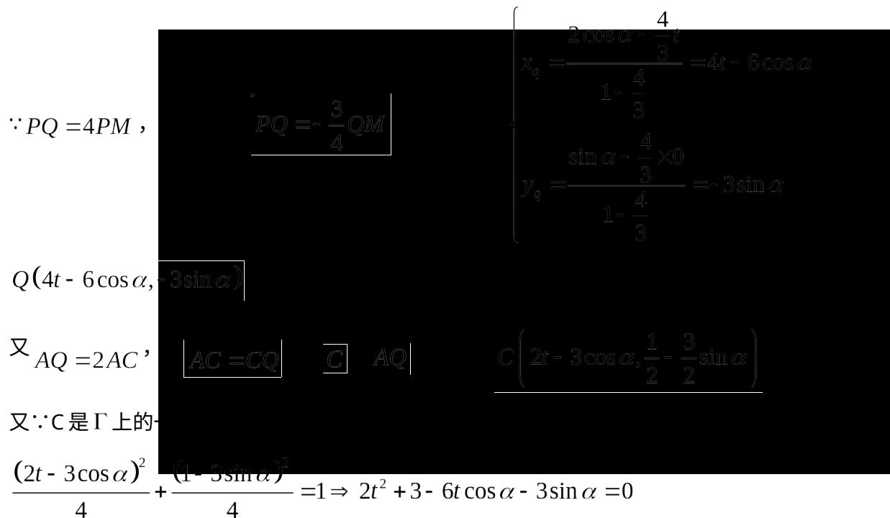
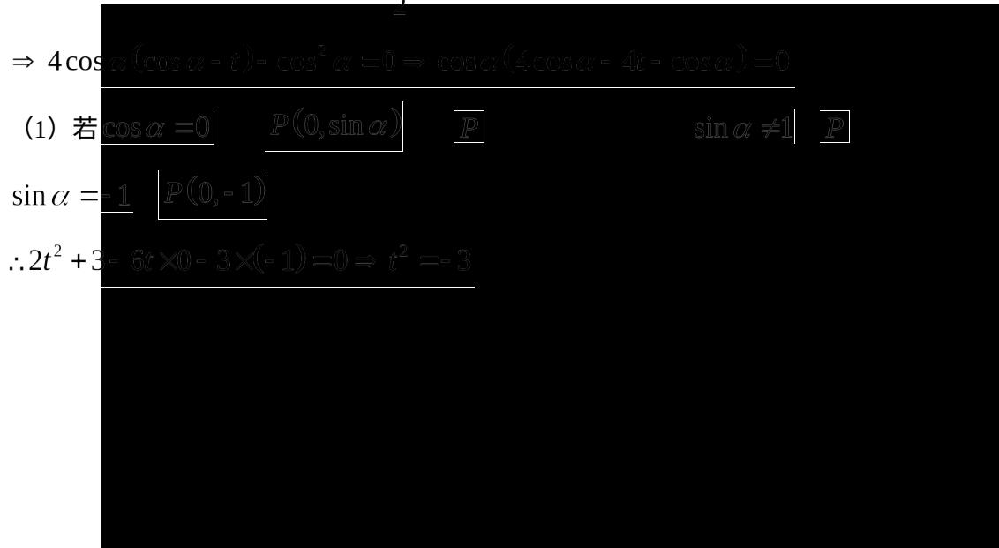

> [!faq]- 2017年上海高考数学真题试卷（word解析版）解析
>
> > [!success]- **【答案】** 详见解析
>
> > [!note]- **【分析】**
> > 本题未单列分析。
>
> > [!note]- **【解析】**
> > （1） $\left[\frac{\pi}{2},\pi\right)$
> >
> > (2) $S_{\triangle ABC} = \frac{15\sqrt{3}}{4}$
> >
> > ## 19. （本题满分 14 分，第 1 小题满分 6 分，第 2 小题满分 8 分）
> >
> > 根据预测，某地第 $n(n \in \mathbb{N}^*)$ 个月共享单车的投放量和损失量分别为 $a_{n}$ 和 $b_{n}$ （单位：辆），其中 $a_{n} = \begin{cases} 5n^{4} + 15, & 1 \leq n \leq 3, \\ -10n + 470, & n \geq 4, \end{cases}$ $b_{n} = n + 5$ . 第 $n$ 个月底的共享单车的保有量是前 $n$ 个月的累计投放量与累计损失量的差.
> >
> > (1) 求该地第 4 个月底的共享单车的保有量；
> >
> > (2) 已知该地共享单车停放点第 $n$ 个月底的单车容纳量 $S_{n} = -4(n - 46)^{2} + 8800$ （单位：辆）. 设在某月底，共享单车保有量达到最大，问该保有量是否超出了此时停放点的单车容纳量？
> >
> > 【
> >
> > (3) $\because$ 点 $P$ 是 $\Gamma$ 上一动点，设 $P(2\cos \alpha, \sin \alpha)$ ， $M(t,0)$ ， $t > 0$ ， $Q(x_q, y_q)$ ， $C(x_c, y_c)$ ，且 $A(0,1)$ 。
> >
> > 记线段 $AP$ 中点为点 $N(x_{n},y_{n})$ ，则 $N\left(\cos \alpha ,\frac{\sin\alpha + 1}{2}\right)$
> >
> > 
> >
> > $\frac{(2t - 3\cos\alpha)^{2}}{4} + \frac{(1 - 5\sin\alpha)^{2}}{4} = 1 \Rightarrow 2t^{2} + 3 - 6t\cos\alpha - 3\sin\alpha = 0$
> >
> > $\because \left|MA\right| = \left|MP\right|$ ， $\therefore \triangle MAP$ 为等腰三角形， $N$ 为底边 $AP$ 中点， $\therefore MN \perp AP$
> >
> > ∵MN = (cos α - t, $\frac{\sin \alpha + 1}{2}$ ), AP = (2 cos α, sin α - 1),
> >
> > ∴MN ·AP = 2 cos α (cos α - t) + $\frac{1}{2}$ (sin α + 1) (sin α - 1) = 0
> >
> > 
> >
> > (2) $\cos \alpha \neq 0$ ，则 $3\cos \alpha - 4t = 0 \Rightarrow t = \frac{3}{4}\cos \alpha > 0$ ， $\therefore \cos \alpha > 0$
> >
> > $$
> > \therefore 2 \left(\frac {3}{4} \cos \alpha\right) ^ {2} + 3 - 6 \times \frac {3}{4} \cos \alpha \times \cos \alpha - 3 \sin \alpha = 0 \Rightarrow 9 \sin^ {2} \alpha - 8 \sin \alpha - 1 = 0
> > $$
> >
> > $\therefore \sin \alpha = -\frac{1}{9}$ 或 1（舍）， $\therefore \cos \alpha = \frac{4\sqrt{5}}{9}$ ， $\therefore t = \frac{3}{4} \times \frac{4\sqrt{5}}{9} = \frac{\sqrt{5}}{3}$
> >
> > $\therefore Q\left(-\frac{4\sqrt{5}}{3}, \frac{1}{3}\right), \therefore k_{AQ} = \frac{1 - \frac{1}{3}}{0 - \left(\frac{4\sqrt{5}}{3}\right)} = \frac{\sqrt{5}}{10}, \therefore$ 直线AQ方程 $y = \frac{\sqrt{5}}{10} x + 1$
