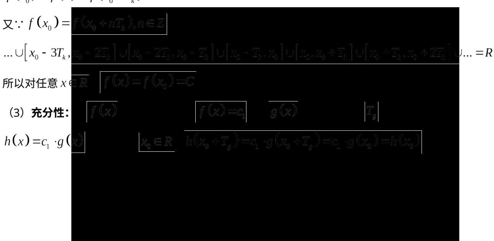

> [!faq]- 2017年上海高考数学真题试卷（word解析版）解析
>
> > [!success]- **【答案】** 详见解析
>
> > [!note]- **【分析】**
> > 本题未单列分析。
>
> > [!note]- **【解析】**
> > 答案】（1）记 $x_{1} < x_{2}$ ，若 $f(x_{1}) \leq f(x_{2})$ ， $f(x) = ax^{3} + 1$
> >
> > 则 $f(x_{1}) - f(x_{2}) = a(x_{1}^{3} - x_{2}^{3})\leq 0$ ， $\because x_1 <   x_2$ ， $\therefore x_1^3 -x_2^3 <  0$ ， $\therefore a\geq 0$
> >
> > (2) 若 $f(x)$ 是周期函数，记其周期为 $T_{k}$ ，任取 $x_0 \in R$ ，则有 $f(x_0) = f(x_0 + T_k)$
> >
> > 又由题意，对任意 $x \in \left[x_0, x_0 + T_k\right]$ ， $f(x_0) \leq f(x) \leq f(x_0 + T_k)$ ， $\therefore$
> >
> > $$
> > f \left(x _ {0}\right) = f (x) = f \left(x _ {0} + T _ {k}\right)
> > $$
> >
> > 
> >
> > $h(x)$ 是周期函数成立。
> >
> > 必要性：若 $h(x)$ 是周期函数，记其一个周期为 $T_{h}$ 。集合 $A=\left\{x \mid g(x)=m\right\}$
> >
> > 任取 $x_0 \in A$ ，则必存在 $N_2 \in N$ ，使得 $x_0 - N_2 T_h \leq x_0 - T_g$ ，即
> >
> > $$
> > \left[ x _ {0} - T _ {g}, x _ {0} \right] \subseteq \left[ x _ {0} - N _ {2} T _ {h}, x _ {0} \right],
> > $$
> >
> > $$
> > \dots \cup \left[ x _ {0} - 3 T _ {g}, x _ {0} - 2 T _ {g} \right] \cup \left[ x _ {0} - 2 T _ {g}, x _ {0} - T _ {g} \right] \cup \left[ x _ {0} - T _ {g}, x _ {0} \right] \cup \left[ x _ {0}, x _ {0} + T _ {g} \right] \cup \left[ x _ {0} + T _ {g}, x _ {0} + 2 T _ {g} \right] \cup \dots = R
> > $$
> >
> > $$
> > \dots \cup \left[ x _ {0} - 2 N _ {2} T _ {h}, x _ {0} - N _ {2} T _ {h} \right] \cup \left[ x _ {0} - N _ {2} T _ {h}, x _ {0} \right] \cup \left[ x _ {0}, x _ {0} + N _ {2} T _ {h} \right] \cup \left[ x _ {0} + N _ {2} T _ {h}, x _ {0} + 2 N _ {2} T _ {h} \right] \cup \dots = R
> > $$
> >
> > $$
> > h \left(x _ {0}\right) = g \left(x _ {0}\right) \cdot f \left(x _ {0}\right) = h \left(x _ {0} - N _ {2} T _ {h}\right) = g \left(x _ {0} - N _ {2} T _ {h}\right) \cdot f \left(x _ {0} - N _ {2} T _ {h}\right)
> > $$
> >
> > 因为 $g(x_0) = M \geq g(x_0 - N_2T_h) > 0$ ， $f(x_0) \geq f(x_0 - N_2T_h) > 0$ ，因此若
> >
> > $$
> > h \left(x _ {0}\right) = h \left(x _ {0} - N _ {2} T _ {h}\right)
> > $$
> >
> > 必有 $g(x_{0})=M=g(x_{0}-N_{2}T_{h})$ ，且 $f(x_{0})=f(x_{0}-N_{2}T_{h})=c$ ，而由第（2）问证明可知对
> >
> > 任意 $x \in R$ ， $f(x) = f(x_0) = C$ ，为常数。必要性证毕。
