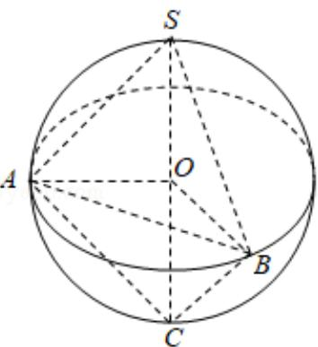

> [!faq]- 2017年全国统一高考数学试卷（文科）（新课标ⅰ）（含解析版）解析
>
> > [!success]- **【答案】** 为： $36\pi$  【点评】本题考查球的内接体，三棱锥的体积以及球的表面积的求法，考查空间想 象能力以及计算能力. ## 三、解答题：共70分。
>
> > [!note]- **【分析】**
> > 判断三棱锥的形状，利用几何体的体积，求解球的半径，然后求解球的表
>
> > [!note]- **【解析】**
> > 分析】判断三棱锥的形状，利用几何体的体积，求解球的半径，然后求解球的表
> >
> > 面积.
> >
> > 【
> > 解答】解：三棱锥 S-ABC 的所有顶点都在球 O 的球面上，SC 是球 O 的直径，若
> >
> > 平面 SCA⊥平面 SCB，SA=AC，SB=BC，三棱锥 S-ABC 的体积为 9，
> >
> > 可知三角形 SBC 与三角形 SAC 都是等腰直角三角形，设球的半径为 r，
> >
> > 可得 $\frac{1}{3} \times \frac{1}{2} \times 2r \times r \times r = 9$ ，解得 $r = 3$ .
> >
> > 球 O 的表面积为： $4\pi r^{2}=36\pi$ .
> >
> > 故
> > 答案为： $36\pi$
> >
> > 
> >
> > 【点评】本题考查球的内接体，三棱锥的体积以及球的表面积的求法，考查空间想
> >
> > 象能力以及计算能力.
> >
> > ## 三、解答题：共70分。
> > 解答应写出文字说明、证明过程或演算过程．第17～21题
> >
> > 为必选题，每个试题考生都必须作答。第22、23题为选考题，考生根据要求作
> >
> > 答。（一）必考题：共60分。
