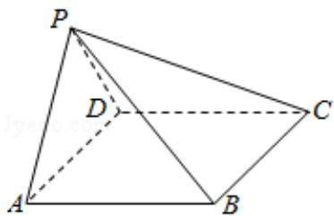

<!-- question-source:start -->
18. （12分）如图，在四棱锥P-ABCD中， $AB\|CD$ ，且 $\angle BAP=\angle CDP=90^{\circ}$

(1) 证明: 平面 PAB⊥平面 PAD;

(2) 若 PA=PD=AB=DC, $\angle APD=90^{\circ}$ , 且四棱锥 P-ABCD 的体积为 $\frac{8}{3}$ , 求该四棱锥的侧面积.

<!-- question-source:end -->

![[高中/真题/按年份分类/2017/2017年全国统一高考数学试卷_文科__新课标ⅰ__含解析版_/解答题/题目/answers/Q00024905A1.md]]
