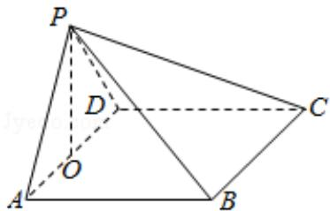

> [!faq]- 2017年全国统一高考数学试卷（文科）（新课标ⅰ）（含解析版）解析
>
> > [!success]- **【答案】** 详见解析
>
> > [!note]- **【分析】**
> > （1）推导出 AB⊥PA, CD⊥PD, 从而 AB⊥PD, 进而 AB⊥平面 PAD, 由此能证
>
> > [!note]- **【解析】**
> > 证明：（1）∵在四棱锥 P-ABCD 中， $\angle BAP=\angle CDP=90^{\circ}$ ，
> >
> > ∴AB⊥PA，CD⊥PD，
> >
> > 又 AB∥CD，∴AB⊥PD，
> >
> > ∵PA∩PD=P，∴AB⊥平面PAD，
> >
> > ∵ABC平面PAB，∴平面PAB⊥平面PAD.
> >
> > 解：
> > （2）设 PA=PD=AB=DC=a，取 AD 中点 O，连结 PO，
> >
> > ∵PA=PD=AB=DC，∠APD=90°，平面PAB⊥平面PAD，
> >
> > ∴PO⊥底面ABCD，且 $AD=\sqrt{a^{2}+a^{2}}=\sqrt{2}a,\quad PO=\frac{\sqrt{2}}{2}a,$
> >
> > ∵四棱锥 P-ABCD 的体积为 $\frac{8}{3}$ ,
> >
> > 由 AB⊥平面 PAD，得 AB⊥AD，
> >
> > $$
> > \therefore \mathrm{V} _ {\mathrm{P-ABCD}} = \frac {1}{3} \times \mathrm{S} _ {\text {四边形ABCD}} \times \mathrm{PO}
> > $$
> >
> > $$
> > = \frac {1}{3} \times A B \times A D \times P O = \frac {1}{3} \times a \times \sqrt {2} a \times \frac {\sqrt {2}}{2} a = \frac {1}{3} a ^ {3} = \frac {8}{3},
> > $$
> >
> > 解得 a=2，∴ PA=PD=AB=DC=2，AD=BC= $2\sqrt{2}$ ，PO= $\sqrt{2}$ ，
> >
> > $$
> > \therefore P B = P C = \sqrt {4 + 4} = 2 \sqrt {2},
> > $$
> >
> > ∴该四棱锥的侧面积：
> >
> > $$
> > S _ {\text {侧}} = S _ {\triangle P A D} + S _ {\triangle P A B} + S _ {\triangle P D C} + S _ {\triangle P B C}
> > $$
> >
> > $$
> > = \frac {1}{2} \times \mathrm{PA} \times \mathrm{PD} + \frac {1}{2} \times \mathrm{PA} \times \mathrm{AB} + \frac {1}{2} \times \mathrm{PD} \times \mathrm{DC} + \frac {1}{2} \times \mathrm{BC} \times \sqrt {\mathrm{PB} ^ {2} - (\frac {\mathrm{BC}}{2}) ^ {2}}
> > $$
> >
> > $$
> > = \frac {1}{2} \times 2 \times 2 + \frac {1}{2} \times 2 \times 2 + \frac {1}{2} \times 2 \times 2 + \frac {1}{2} \times 2 \sqrt {2} \times \sqrt {8 - 2}
> > $$
> >
> > $$
> > = 6 + 2 \sqrt {3}.
> > $$
> >
> > 
> >
> > 【点评】本题考查面面垂直的证明, 考查四棱锥的侧面积的求法, 考查空间中线线、
> > 线面、面面间的位置关系等基础知识, 考查推理论证能力、运算求解能力、空
> > 间想象能力, 考查数形结合思想、化归与转化思想, 是中档题.
