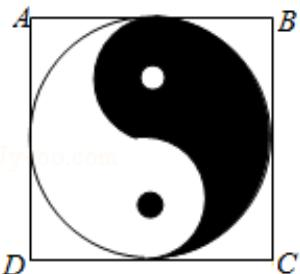

<!-- question-source:start -->
4. (5 分) 如图, 正方形 ABCD 内的图形来自中国古代的太极图. 正方形内切圆中
的黑色部分和白色部分关于正方形的中心成中心对称. 在正方形内随机取一
点, 则此点取自黑色部分的概率是 ( )

M  

A. $\frac{1}{4}$ B. $\frac{\pi}{8}$ C. $\frac{1}{2}$ D. $\frac{\pi}{4}$
<!-- question-source:end -->

![[高中/真题/按年份分类/2017/2017年全国统一高考数学试卷_文科__新课标ⅰ__含解析版_/选择题/题目/answers/Q00024891A1.md]]
