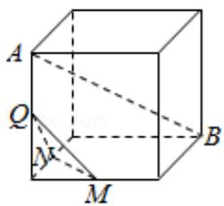
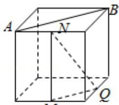
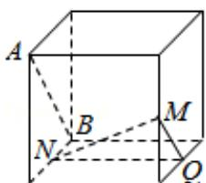
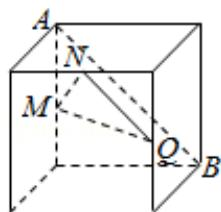

<!-- question-source:start -->
6. (5 分) 如图, 在下列四个正方体中, A, B 为正方体的两个顶点, M, N, Q 为所在棱的中点, 则在这四个正方体中, 直线 AB 与平面 MNQ 不平行的是 ( )

A.

B.

  
C.

D.
<!-- question-source:end -->

![[高中/真题/按年份分类/2017/2017年全国统一高考数学试卷_文科__新课标ⅰ__含解析版_/选择题/题目/answers/Q00024893A1.md]]
