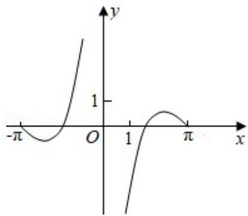
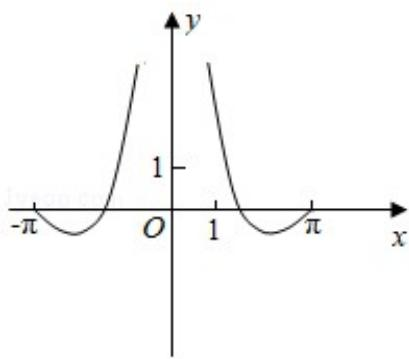
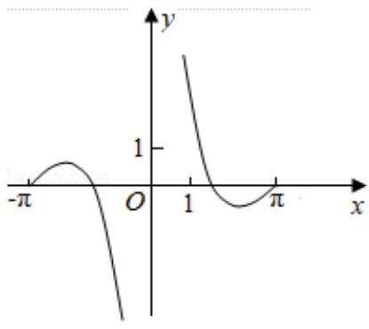
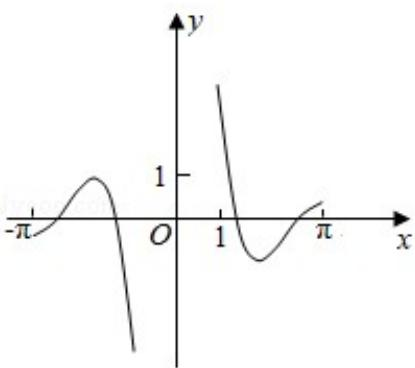

<!-- question-source:start -->
8.（5分）函数 $y = \frac{\sin 2x}{1 - \cos x}$ 的部分图象大致为（）

A.

B.  

C.

D.
<!-- question-source:end -->

![[高中/真题/按年份分类/2017/2017年全国统一高考数学试卷_文科__新课标ⅰ__含解析版_/选择题/题目/answers/Q00024895A1.md]]
