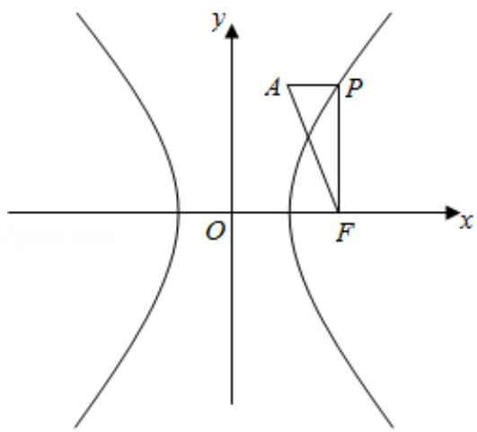

> [!faq]- 2017年全国统一高考数学试卷（文科）（新课标ⅰ）（含解析版）解析
>
> > [!success]- **【答案】** D
>
> > [!note]- **【分析】**
> > 由题意求得双曲线的右焦点 $F(2,0)$ ，由PF与x轴垂直，代入即可求得P
>
> > [!note]- **【解析】**
> > 分析】由题意求得双曲线的右焦点 $F(2,0)$ ，由PF与x轴垂直，代入即可求得P
> >
> > 点坐标，根据三角形的面积公式，即可求得 $\triangle APF$ 的面积.
> >
> > 【
> > 解答】解：由双曲线 C: $x^{2}-\frac{y^{2}}{3}=1$ 的右焦点 F（2，0），
> >
> > PF 与 x 轴垂直，设 $(2, y)$ ，y > 0，则 y = 3，
> >
> > 则 P（2，3），
> >
> > ∴AP⊥PF，则|AP|=1，|PF|=3，
> >
> > $\therefore \triangle APF$ 的面积 $S = \frac{1}{2} \times |AP| \times |PF| = \frac{3}{2}$ ,
> >
> > 同理当 y<0 时，则 $\triangle APF$ 的面积 $S=\frac{3}{2}$ ,
> >
> > 故选：D.
> >
> > 
> >
> > 【点评】本题考查双曲线的简单几何性质，考查数形结合思想，属于基础题.
