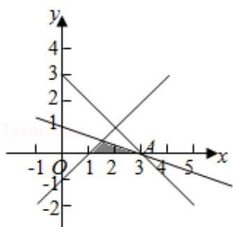

> [!faq]- 2017年全国统一高考数学试卷（文科）（新课标ⅰ）（含解析版）解析
>
> > [!success]- **【答案】** D
>
> > [!note]- **【分析】**
> > 画出约束条件的可行域，利用目标函数的最优解求解目标函数的最大值
>
> > [!note]- **【解析】**
> > 解：x，y 满足约束条件 $\left\{\begin{aligned}x+3y&\leqslant3\\ x-y&\geqslant1\\ y&\geqslant0\end{aligned}\right.$ 的可行域如图：
> >
> > ，则 $z = x + y$ 经过可行域的A时，目标函数取得最大值，
> >
> > 由 $\left\{\begin{aligned}y=0\\ x+3y=3\end{aligned}\right.$ 解得A(3,0)
> >
> > 所以 $z=x+y$ 的最大值为：3.
> >
> > 故选：D.
> >
> > 
