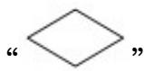

> [!faq]- 2017年全国统一高考数学试卷（文科）（新课标ⅰ）（含解析版）解析
>
> > [!success]- **【答案】** D
>
> > [!note]- **【分析】**
> > 通过要求 A>1000 时输出且框图中在 “否” 时输出确定 “√”
>
> > [!note]- **【解析】**
> > 解：因为要求 A>1000 时输出，且框图中在 “否” 时输出，
> >
> > 
> >
> > 所以 “ √ ” 内不能输入 “A>1000”,
> >
> > 又要求 n 为偶数，且 n 的初始值为 0，
> >
> > 
> >
> > 所以 “☐” 中 n 依次加 2 可保证其为偶数，
> >
> > 所以 D 选项满足要求，
> >
> > 故选：D.
