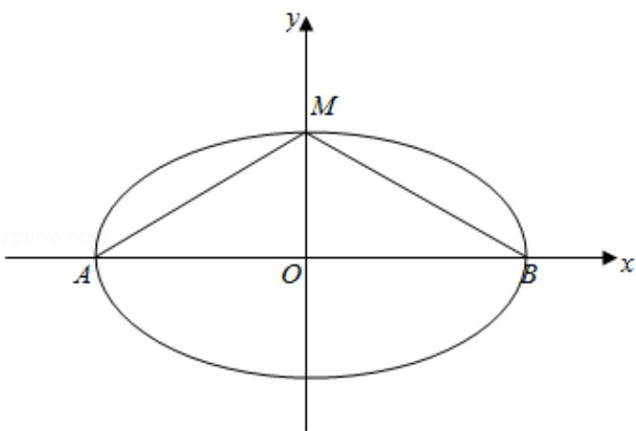
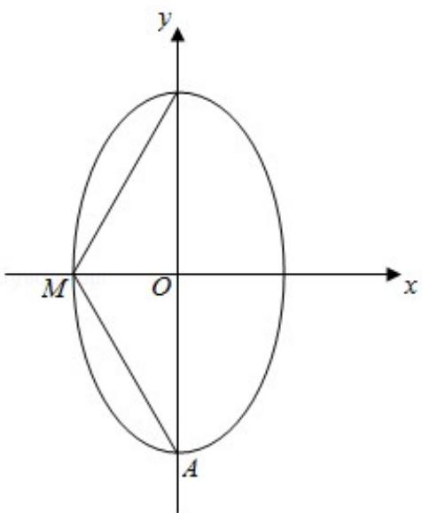

> [!faq]- 2017年全国统一高考数学试卷（文科）（新课标ⅰ）（含解析版）解析
>
> > [!success]- **【答案】** A
>
> > [!note]- **【分析】**
> > 分类讨论，由要使椭圆 C 上存在点 M 满足
>
> > [!note]- **【解析】**
> > 解：假设椭圆的焦点在 x 轴上，则 0 < m < 3 时，
> >
> > 设椭圆的方程为： $\frac{x^{2}}{a^{2}}+\frac{y^{2}}{b^{2}}=1\left(a>b>0\right)$ ，设A $(-a,0)$ ，B $(a,0)$ ，M $(x,y)$ ，y>0，
> >
> > 则 $a^2 - x^2 = \frac{a^2y^2}{b^2}$ ,
> >
> > $\angle MAB = \alpha, \angle MBA = \beta, \angle AMB = \gamma, \tan \alpha = \frac{y}{x + a}, \tan \beta = \frac{y}{a - x}$ ,
> >
> > $$
> > \text {则} \tan \gamma = \tan [ \pi - (\alpha + \beta) ] = - \tan (\alpha + \beta) = - \frac {\tan \alpha + \tan \beta}{1 - \tan \alpha \tan \beta} = - \frac {2 a y}{a ^ {2} - x ^ {2} - y ^ {2}} = -
> > $$
> >
> > $$
> > \frac {\frac {2 a y}{a ^ {2} y ^ {2}}}{b ^ {2} - y ^ {2}} = - \frac {2 a b ^ {2}}{y (a ^ {2} - b ^ {2})} = - \frac {2 a b ^ {2}}{c ^ {2} y},
> > $$
> >
> > $\therefore \tan \gamma = -\frac{2ab^2}{c^2y}$ 当 $y$ 最大时，即 $y = b$ 时，∠AMB取最大值，
> >
> > ∴M 位于短轴的端点时，∠AMB 取最大值，要使椭圆 C 上存在点 M 满足
> >
> > $$
> > \angle A M B = 1 2 0 ^ {\circ},
> > $$
> >
> > $\angle AMB \geq 120^{\circ}$ , $\angle AMO \geq 60^{\circ}$ , $\tan \angle AMO = \frac{\sqrt{3}}{\sqrt{m}} \geq \tan 60^{\circ} = \sqrt{3}$ ,
> >
> > 解得： $0 < m \leq 1$
> >
> > 
> >
> > 当椭圆的焦点在 y 轴上时，m > 3，
> >
> > 当 M 位于短轴的端点时，∠AMB 取最大值，要使椭圆 C 上存在点 M 满足
> >
> > $$
> > \angle A M B = 1 2 0 ^ {\circ}
> > $$
> >
> > $\angle AMB \geq 120^{\circ}$ , $\angle AMO \geq 60^{\circ}$ , $\tan \angle AMO = \frac{\sqrt{m}}{\sqrt{3}} \geq \tan 60^{\circ} = \sqrt{3}$ , 解得: $m \geq 9$ ,
> >
> > ∴m 的取值范围是 $(0, 1] \cup [9, +\infty)$
> >
> > 故选A.
> >
> > 
> >
> > 故选：A.
> >
> > 【点评】本题考查椭圆的标准方程, 特殊角的三角函数值, 考查分类讨论思想及数
> >
> > 形结合思想的应用，考查计算能力，属于中档题.
> >
> > ##
> > 二、填空题：本题共4小题，每小题5分，共20分。
