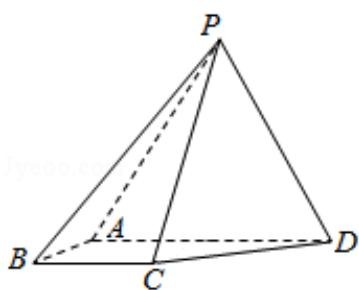

<!-- question-source:start -->
18. （12分）如图，四棱锥P-ABCD中，侧面PAD为等边三角形且垂直于底面ABCD， $AB=BC=\frac{1}{2}AD,\angle BAD=\angle ABC=90^{\circ}$ .

(1) 证明: 直线 BC $\parallel$ 平面 PAD;

(2) 若 $\triangle PCD$ 面积为 $2\sqrt{7}$ , 求四棱锥 P - ABCD 的体积.

<!-- question-source:end -->

![[高中/真题/按年份分类/2017/2017年全国统一高考数学试卷_文科__新课标ⅱ__含解析版_/解答题/题目/answers/Q00024998A1.md]]
