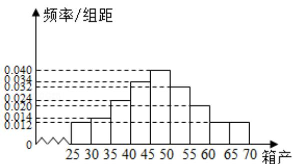
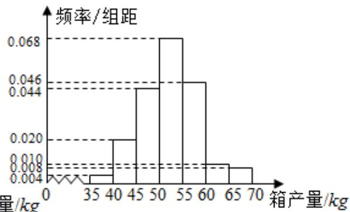

<!-- question-source:start -->
19.（12 分）海水养殖场进行某水产品的新、旧网箱养殖方法的产量对比，收获时

各随机抽取了 100 个网箱，测量各箱水产品的产量（单位：kg），其频率分布直

方图如下:

  
旧养殖法

  
新养殖法

(1) 记 A 表示事件 “旧养殖法的箱产量低于 50kg”，估计 A 的概率；

(2) 填写下面列联表，并根据列联表判断是否有 $99\%$ 的把握认为箱产量与养殖方

法有关：

<table><tr><td></td><td>箱产量&lt;50kg</td><td>箱产量≥50kg</td></tr><tr><td>旧养殖法</td><td></td><td></td></tr><tr><td>新养殖法</td><td></td><td></td></tr></table>

(3) 根据箱产量的频率分布直方图，对两种养殖方法的优劣进行比较.

附：

<table><tr><td>P (K2≥K)</td><td>0.050</td><td>0.010</td><td>0.001</td></tr><tr><td>K</td><td>3.841</td><td>6.635</td><td>10.828</td></tr></table>

$$
K ^ {2} = \frac {n (a d - b c) ^ {2}}{(a + b) (c + d) (a + c) (b + d)}.
$$
<!-- question-source:end -->

![[高中/真题/按年份分类/2017/2017年全国统一高考数学试卷_文科__新课标ⅱ__含解析版_/解答题/题目/answers/Q00024999A1.md]]
