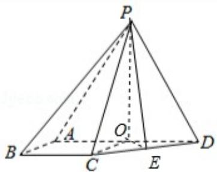

> [!faq]- 2017年全国统一高考数学试卷（文科）（新课标ⅱ）（含解析版）解析
>
> > [!success]- **【答案】** 详见解析
>
> > [!note]- **【分析】**
> > （1）利用直线与平面平行的判定定理证明即可.
> > (2) 利用已知条件转化求解几何体的线段长，然后求解几何体的体积即可.
>
> > [!note]- **【解析】**
> > （1）证明：四棱锥 P-ABCD 中，∵∠BAD=∠ABC=90°.∴BC∥AD，∵ADC平
> >
> > 面 PAD，BC≠平面 PAD，
> >
> > ∴直线 BC∥平面 PAD;
> > (2) 解: 四棱锥 P - ABCD 中, 侧面 PAD 为等边三角形且垂直于底面 ABCD, AB = BC =
> >
> > $\frac{1}{2}AD,\quad\angle BAD=\angle ABC=90^{\circ}.$ 设 AD=2x,
> >
> > 则 AB=BC=x， $CD=\sqrt{2}x$ ，O 是 AD 的中点，
> >
> > 连接 PO，OC，CD 的中点为：E，连接 OE，
> >
> > 则 $OE=\frac{\sqrt{2}}{2}x,\quad PO=\sqrt{3}x,\quad PE=\sqrt{PO^{2}+OE^{2}}=\frac{\sqrt{7}x}{\sqrt{2}}$
> >
> > $\triangle \mathrm{PCD}$ 面积为 $2\sqrt{7}$ ，可得： $\frac{1}{2}\mathrm{PE} \cdot \mathrm{CD} = 2\sqrt{7}$ ，
> >
> > 即： $\frac{1}{2}\times \frac{\sqrt{7}}{\sqrt{2}} x^{*}\sqrt{2} x = 2\sqrt{7}$ ，解得 $x = 2$ ， $\mathrm{PO} = 2\sqrt{3}$
> >
> > 则 $V_{P-ABCD}=\frac{1}{3}\times\frac{1}{2}$ (BC+AD) $\times AB\times PO=\frac{1}{3}\times\frac{1}{2}\times(2+4)\times2\times2\sqrt{3}=4\sqrt{3}.$
> >
> > 
> >
> > 【点评】本题考查直线与平面平行的判定定理的应用, 几何体的体积的求法, 考查空间想象能力以及计算能力.
