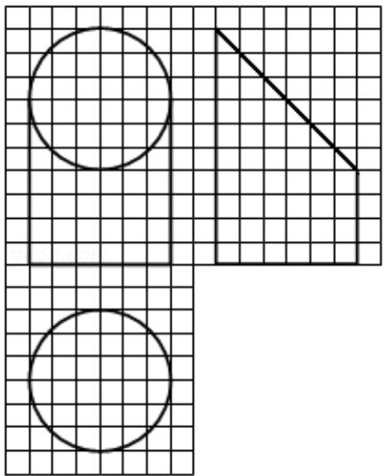

<!-- question-source:start -->
6. (5 分) 如图, 网格纸上小正方形的边长为 1 , 粗实线画出的是某几何体的三视图, 该几何体由一平面将一圆柱截去一部分后所得, 则该几何体的体积为 ( )

A. $90\pi$ B. $63\pi$ C. $42\pi$ D. $36\pi$
<!-- question-source:end -->

![[高中/真题/按年份分类/2017/2017年全国统一高考数学试卷_文科__新课标ⅱ__含解析版_/选择题/题目/answers/Q00024986A1.md]]
