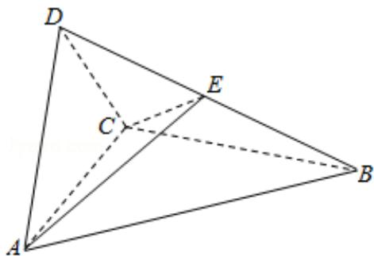

<!-- question-source:start -->
19. （12 分）如图四面体 ABCD 中， $\triangle ABC$ 是正三角形，AD=CD.

(1) 证明: $AC \perp BD$ ;

(2) 已知 $\triangle ACD$ 是直角三角形, $AB = BD$ , 若 $E$ 为棱 $BD$ 上与 $D$ 不重合的点, 且

AE⊥EC，求四面体 ABCE 与四面体 ACDE 的体积比.

<!-- question-source:end -->

![[高中/真题/按年份分类/2017/2017年全国统一高考数学试卷_文科__新课标ⅲ__含解析版_/填空题/题目/answers/Q00026856A1.md]]
