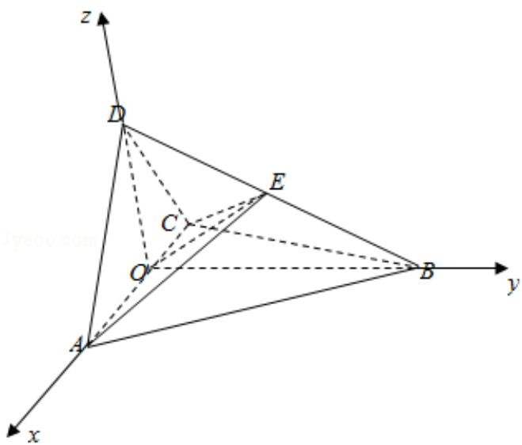

> [!faq]- 2017年全国统一高考数学试卷（文科）（新课标ⅲ）（含解析版）解析
>
> > [!success]- **【答案】** 详见解析
>
> > [!note]- **【分析】**
> > （1）取 AC 中点 O，连结 DO、BO，推导出 DO⊥AC，BO⊥AC，从而 AC⊥平面
>
> > [!note]- **【解析】**
> > 分析】（1）取 AC 中点 O，连结 DO、BO，推导出 DO⊥AC，BO⊥AC，从而 AC⊥平面
> >
> > BDO，由此能证明 AC⊥BD.
> >
> > (2) 法一: 连结 OE, 设 $AD=CD=\sqrt{2}$ , 则 OC=OA=1, 由余弦定理求出 BE=1, 由 BE=ED,
> >
> > 四面体 ABCE 与四面体 ACDE 的高都是点 A 到平面 BCD 的高 h, $S_{\triangle DCE} = S_{\triangle BCE}$ ，由此
> >
> > 能求出四面体 ABCE 与四面体 ACDE 的体积比．法二：设 AD=CD= $\sqrt{2}$ ，则
> >
> > AC=AB=BC=BD=2, AO=CO=DO=1, BO= $\sqrt{3}$ , 推导出 BO⊥DO, 以 O 为原点, OA 为 x
> >
> > 轴，OB 为 y 轴，OD 为 z 轴，建立空间直角坐标系，由 AE⊥EC，求出 DE=BE，由此
> >
> > 能求出四面体 ABCE 与四面体 ACDE 的体积比.
> >
> > 【
> > 解答】证明：（1）取 AC 中点 O，连结 DO、BO，
> >
> > ∵△ABC 是正三角形，AD=CD，
> >
> > $$
> > \therefore D O \perp A C, B O \perp A C,
> > $$
> >
> > ∵DO∩BO=O，∴AC⊥平面BDO，
> >
> > ∵BDC平面 BDO，∴AC⊥BD.
> >
> > 解：（2）法一：连结 OE，由（1）知 AC⊥平面 OBD，
> >
> > ∵OEC平面 OBD，∴OE⊥AC，
> >
> > 设 $AD=CD=\sqrt{2}$ ，则 OC=OA=1，EC=EA，
> >
> > ∵AE⊥CE, AC=2, ∴EC²+EA²=AC²,
> >
> > $$
> > \therefore E C = E A = \sqrt {2} = C D,
> > $$
> >
> > ∴E 是线段 AC 垂直平分线上的点，∴EC=EA=CD= $\sqrt{2}$ ,
> >
> > 由余弦定理得：
> >
> > $$
> > \cos \angle C B D = \frac {B C ^ {2} + B D ^ {2} - C D ^ {2}}{2 B C \cdot B D} = \frac {B C ^ {2} + B E ^ {2} - C E ^ {2}}{2 B C \cdot B E},
> > $$
> >
> > 即 $\frac{4 + 4 - 2}{2\times 2\times 2} = \frac{4 + BE^2 - 2}{2\times 2\times BE}$ ，解得BE=1或BE=2，
> >
> > $$
> > \because B E <   <   B D = 2, \therefore B E = 1, \therefore B E = E D,
> > $$
> >
> > ∵四面体 ABCE 与四面体 ACDE 的高都是点 A 到平面 BCD 的高 h，
> >
> > $$
> > \because \mathrm{BE} = \mathrm{ED}, \quad \therefore S _ {\triangle D C E} = S _ {\triangle B C E},
> > $$
> >
> > ∴四面体 ABCE 与四面体 ACDE 的体积比为 1.
> >
> > 法二：设 $AD=CD=\sqrt{2}$ ，则 AC=AB=BC=BD=2，AO=CO=DO=1，
> >
> > $$
> > \therefore \mathrm{BO} = \sqrt {4 - 1} = \sqrt {3}, \quad \therefore \mathrm{BO} ^ {2} + \mathrm{DO} ^ {2} = \mathrm{BD} ^ {2}, \quad \therefore \mathrm{BO} \perp \mathrm{DO},
> > $$
> >
> > 以 O 为原点，OA 为 x 轴，OB 为 y 轴，OD 为 z 轴，建立空间直角坐标系，
> >
> > 则 C（-1，0，0），D（0，0，1），B（0， $\sqrt{3}$ ，0），A（1，0，0），
> >
> > 设 $E(a, b, c)$ ， $\overrightarrow{DE} = \lambda \overrightarrow{DB}$ ， $(0 \leq \lambda \leq 1)$ ，则 $(a, b, c - 1) = \lambda (0, \sqrt{3}, -1)$ ，解得 $E(0,$
> >
> > $$
> > \sqrt {3} \lambda , 1 - \lambda),
> > $$
> >
> > $$
> > \therefore \overrightarrow {\mathrm{CE}} = (1, \sqrt {3} \lambda , 1 - \lambda), \overrightarrow {\mathrm{AE}} = (- 1, \sqrt {3} \lambda , 1 - \lambda),
> > $$
> >
> > $$
> > \because A E \perp E C, \therefore \overrightarrow {A E} \cdot \overrightarrow {C E} = - 1 + 3 \lambda^ {2} + (1 - \lambda) ^ {2} = 0,
> > $$
> >
> > 由 $\lambda \in [0, 1]$ ，解得 $\lambda = \frac{1}{2}$ ， $\therefore DE = BE$ ，
> >
> > ∵四面体 ABCE 与四面体 ACDE 的高都是点 A 到平面 BCD 的高 h，
> >
> > $$
> > \because D E = B E, \therefore S _ {\triangle D C E} = S _ {\triangle B C E},
> > $$
> >
> > ∴四面体 ABCE 与四面体 ACDE 的体积比为 1.
> >
> > 
> >
> > 【点评】本题考查线线垂直的证明, 考查两个四面体的体积之比的求法, 考查空间
> >
> > 中线线、线面、面面间的位置关系等基础知识，考查推理论证能力、运算求解
> >
> > 能力、空间想象能力，考查数形结合思想、化归与转化思想，是中档题.
