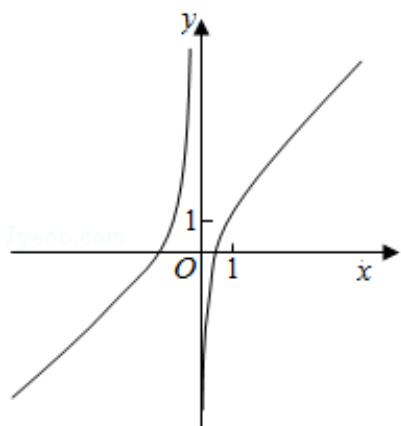
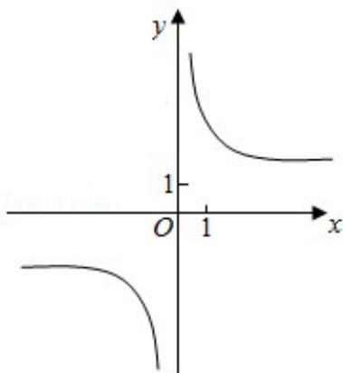

<!-- question-source:start -->
7.（5分）函数 $y = 1 + x + \frac{\sin x}{x^2}$ 的部分图象大致为（）

A.

B.  

  
C.

D.  

<!-- question-source:end -->

![[高中/真题/按年份分类/2017/2017年全国统一高考数学试卷_文科__新课标ⅲ__含解析版_/选择题/题目/answers/Q00026845A1.md]]
