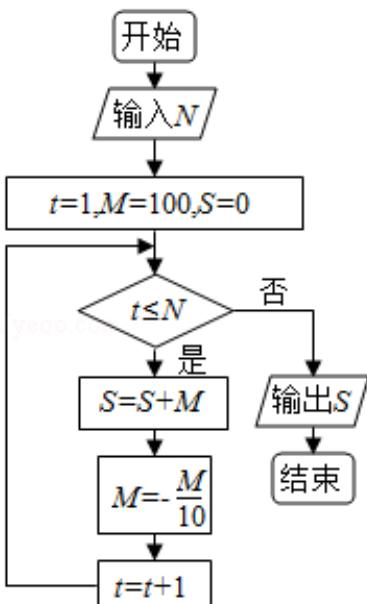

<!-- question-source:start -->
9. 小值为（）

A. 5 B. 4 C. 3 D. 2

上，则该圆柱的体积为（ ）A. $\pi$ B. $\frac{3\pi}{4}$ C. $\frac{\pi}{2}$ D. $\frac{\pi}{4}$
<!-- question-source:end -->

![[高中/真题/按年份分类/2017/2017年全国统一高考数学试卷_文科__新课标ⅲ__含解析版_/选择题/题目/answers/Q00028621A1.md]]
