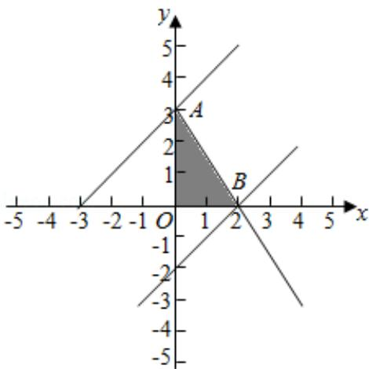

> [!faq]- 2017年全国统一高考数学试卷（文科）（新课标ⅲ）（含解析版）解析
>
> > [!success]- **【答案】** B
>
> > [!note]- **【分析】**
> > 画出约束条件的可行域，利用目标函数的最优解求解目标函数的范围即可.
>
> > [!note]- **【解析】**
> > 解：x，y 满足约束条件 $\left\{\begin{aligned}&3x+2y-6\leqslant0\\&x\geqslant0\\&y\geqslant0\end{aligned}\right.$ 的可行域如图：
> >
> > 目标函数 $z = x - y$ ，经过可行域的A，B时，目标函数取得最值，
> >
> > 由 $\left\{\begin{aligned}x=0\\ 3x+2y-6=0\end{aligned}\right.$ 解得A（0，3），
> >
> > 由 $\left\{\begin{aligned}y=0\\ 3x+2y-6=0\end{aligned}\right.$ 解得B(2,0)，
> >
> > 目标函数的最大值为：2，最小值为：-3，
> >
> > 目标函数的取值范围：[-3，2].
> >
> > 故选：B.
> >
> > 
> >
> > 【点评】本题考查线性规划的简单应用，目标函数的最优解以及可行域的作法是
> > 解题的关键.
