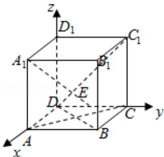

> [!faq]- 2017年全国统一高考数学试卷（文科）（新课标ⅲ）（含解析版）解析
>
> > [!success]- **【答案】** C
>
> > [!note]- **【分析】**
> > 法一：连 $B_{1}C$ ，推导出 $BC_{1}\perp B_{1}C$ ， $A_{1}B_{1}\perp BC_{1}$ ，从而 $BC_{1}\perp$ 平面 $A_{1}ECB_{1}$ ，由此得
>
> > [!note]- **【解析】**
> > 解：法一：连 $B_{1}C$ ，由题意得 $BC_{1}\perp B_{1}C$ ，
> >
> > ∵ $A_{1}B_{1}\perp$ 平面 $B_{1}BCC_{1}$ ，且 $BC_{1}\subset$ 平面 $B_{1}BCC_{1}$ ，
> >
> > $\therefore A_{1}B_{1}\perp BC_{1},$
> >
> > $$
> > \because A _ {1} B _ {1} \cap B _ {1} C = B _ {1},
> > $$
> >
> > $\therefore BC_{1} \perp$ 平面 $A_{1}ECB_{1}$ ,
> >
> > ∵A $_{1}$ EC⊂平面 A $_{1}$ ECB $_{1}$ ,
> >
> > $\therefore A_{1}E \perp BC_{1}.$
> >
> > 故选：C.
> >
> > 法二：以 D 为原点，DA 为 x 轴，DC 为 y 轴， $DD_{1}$ 为 z 轴，建立空间直角坐标系，
> > 设正方体 ABCD - A₁B₁C₁D₁ 中棱长为 2，
> >
> > 则
> >
> > $A_{1}(2,0,2)$ , $E(0,1,0)$ , $B(2,2,0)$ , $D(0,0,0)$ , $C_{1}(0,2,2)$ , $A(2,0,0)$ , $C(0,2,0)$ , 0),
> >
> > $$
> > \overrightarrow {\mathrm{A} _ {1} \mathrm{E}} = (- 2, 1, - 2), \overrightarrow {\mathrm{DC} _ {1}} = (0, 2, 2), \overrightarrow {\mathrm{BD}} = (- 2, - 2, 0)
> > $$
> >
> > $\overrightarrow{BC_1} = (-2, 0, 2)$ , $\overrightarrow{AC} = (-2, 2, 0)$ ,
> >
> > $$
> > \because \overrightarrow {A _ {1} E} \cdot \overrightarrow {D C _ {1}} = - 2, \overrightarrow {A _ {1} E} \cdot \overrightarrow {B D} = 2, \overrightarrow {A _ {1} E} \cdot \overrightarrow {B C _ {1}} = 0, \overrightarrow {A _ {1} E} \cdot \overrightarrow {A C} = 6,
> > $$
> >
> > $\therefore A_{1}E \perp BC_{1}.$
> >
> > 故选：C.
> >
> > 
