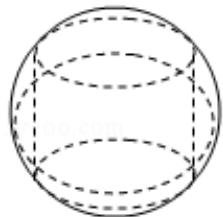

> [!faq]- 2017年全国统一高考数学试卷（文科）（新课标ⅲ）（含解析版）解析
>
> > [!success]- **【答案】** B
>
> > [!note]- **【分析】**
> > 推导出该圆柱底面圆周半径 $r = \sqrt{1^2 - (\frac{1}{2})^2} = \frac{\sqrt{3}}{2}$ ，由此能求出该圆柱的体积.
>
> > [!note]- **【解析】**
> > 解：∵圆柱的高为 1，它的两个底面的圆周在直径为 2 的同一个球的球面上，
> >
> > ∴该圆柱底面圆周半径 $r=\sqrt{1^{2}-\left(\frac{1}{2}\right)^{2}}=\frac{\sqrt{3}}{2}$ ,
> >
> > ∴该圆柱的体积： $V=Sh=\pi\times\left(\frac{\sqrt{3}}{2}\right)^{2}\times1=\frac{3\pi}{4}$
> >
> > 故选：B.
> >
> > 
> >
> > 【点评】本题考查面圆柱的体积的求法，考查圆柱、球等基础知识，考查推理论证
> >
> > 能力、运算求解能力、空间想象能力，考查化归与转化思想，是中档题.
