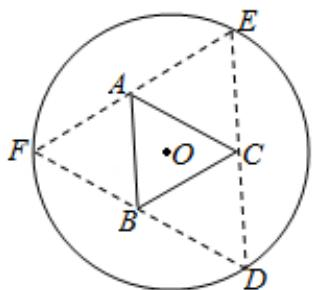

<!-- question-source:start -->
16. (5 分) 如图, 圆形纸片的圆心为 O, 半径为 5cm, 该纸片上的等边三角形 ABC 的中心为 O、D、E、F 为圆 O 上的点, △DBC, △ECA, △FAB 分别是以 BC, CA, AB 为底边的等腰三角形。沿虚线剪开后, 分别以 BC, CA, AB 为折痕折起 △DBC, △ECA, △FAB, 使得 D、E、F 重合, 得到三棱锥。当 △ABC 的边长变化时,所得三棱锥体积（单位： $\mathrm{cm}^3$ ）的最大值为\_\_\_\_。

三、解答题：共70分．
<!-- question-source:end -->

![[高中/真题/按年份分类/2017/2017年全国统一高考数学试卷_理科__新课标ⅰ__含解析版_/填空题/题目/answers/Q00028630A1.md]]
