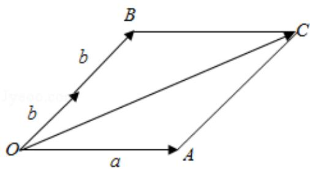

> [!faq]- 2017年全国统一高考数学试卷（理科）（新课标ⅰ）（含解析版）解析
>
> > [!success]- **【答案】** $2\sqrt{3}$
>
> > [!note]- **【分析】**
> > 根据平面向量的数量积求出模长即可.
>
> > [!note]- **【解析】**
> > 解：【解法一】向量 $\vec{a}$ ， $\vec{b}$ 的夹角为 $60^{\circ}$ ，且 $|\vec{a}| = 2$ ， $|\vec{b}| = 1$
> >
> > $$
> > \therefore (\vec {a} + 2 \vec {b}) ^ {2} = \vec {a} ^ {2} + 4 \vec {a} \bullet \vec {b} + 4 \vec {b} ^ {2}
> > $$
> >
> > $$
> > = 2 ^ {2} + 4 \times 2 \times 1 \times \cos 6 0 ^ {\circ} + 4 \times 1 ^ {2}
> > $$
> >
> > =12,
> >
> > $$
> > \therefore | \overrightarrow {a} + 2 \overrightarrow {b} | = 2 \sqrt {3}.
> > $$
> >
> > 【解法二】根据题意画出图形，如图所示；
> >
> > 结合图形 $\overrightarrow{OC}=\overrightarrow{OA}+\overrightarrow{OB}=\overrightarrow{a}+2\overrightarrow{b};$
> >
> > 在 $\triangle OAC$ 中，由余弦定理得
> >
> > $$
> > | \overrightarrow {O C} | = \sqrt {2 ^ {2} + 2 ^ {2} - 2 \times 2 \times 2 \times \cos 1 2 0 ^ {\circ}} = 2 \sqrt {3},
> > $$
> >
> > 即 $|\vec{a} + 2\vec{b}| = 2\sqrt{3}$
> >
> > 故答案为： $2\sqrt{3}$ .
> >
> > 
