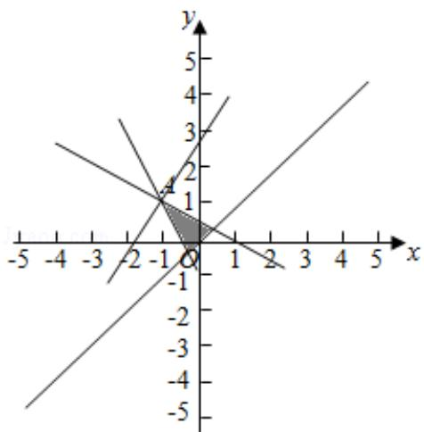

> [!faq]- 2017年全国统一高考数学试卷（理科）（新课标ⅰ）（含解析版）解析
>
> > [!success]- **【答案】** -5
>
> > [!note]- **【分析】**
> > 由约束条件作出可行域，由图得到最优解，求出最优解的坐标，数形结合
>
> > [!note]- **【解析】**
> > 解：由 $x$ ，y满足约束条件 $\left\{ \begin{array}{l} x + 2y \leqslant 1 \\ 2x + y \geqslant -1 \\ x - y \leqslant 0 \end{array} \right.$ 作出可行域如图，
> >
> > 由图可知，目标函数的最优解为 A，
> >
> > 联立 $\left\{\begin{aligned}x+2y=1\\ 2x+y=-1\end{aligned}\right.$ ，解得A $(-1,1)$ 。
> >
> > ∴z=3x-2y的最小值为 $-3\times1-2\times1=-5$ .
> >
> > 故答案为：-5.
> >
> > 
