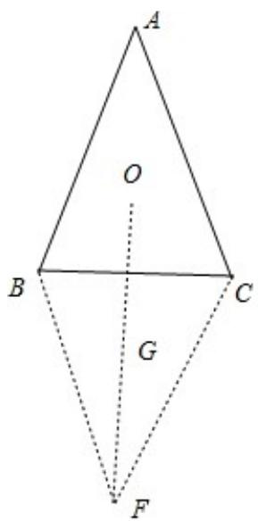
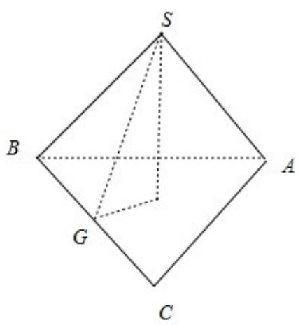
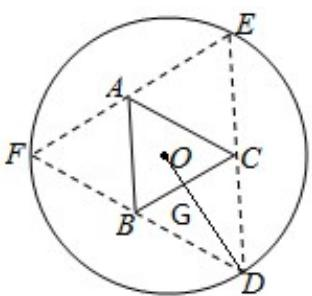

> [!faq]- 2017年全国统一高考数学试卷（理科）（新课标ⅰ）（含解析版）解析
>
> > [!success]- **【答案】** 详见解析
>
> > [!note]- **【分析】**
> > 法一：由题，连接 OD，交 BC 于点 G，由题意得 OD⊥BC，OG= $\frac{\sqrt{3}}{6}$ BC，设
>
> > [!note]- **【解析】**
> > 分析】法一：由题，连接 OD，交 BC 于点 G，由题意得 OD⊥BC，OG= $\frac{\sqrt{3}}{6}$ BC，设
> >
> > OG=x，则 BC=2 $\sqrt{3}$ x，DG=5-x，三棱锥的高 h= $\sqrt{25-10x}$ ，求出 $S_{\triangle ABC}=3\sqrt{3}x^{2}$ ，V=
> >
> > $$
> > \frac {1}{3} S _ {\triangle A B C} \times h = \sqrt {3} \cdot \sqrt {2 5 x ^ {4} - 1 0 x ^ {5}}, \text {令} f (x) = 2 5 x ^ {4} - 1 0 x ^ {5}, x \in (0, \frac {5}{2}), f ^ {\prime} (x) = 1 0 0 x ^ {3} -
> > $$
> >
> > $50x^{4}$ ， $f(x) \leqslant f(2) = 80$ ，由此能求出体积最大值.
> >
> > 法二: 设正三角形的边长为 $x$ , 则 $OG = \frac{1}{3} \times \frac{\sqrt{3}}{2} x = \frac{\sqrt{3}}{6} x$ , $FG = SG = 5 - \frac{\sqrt{3}}{6} x$ , $SO = h = \sqrt{SG^2 - GO^2} = \sqrt{(5 - \frac{\sqrt{3}}{6} x)^2 - (\frac{\sqrt{3}}{6} x)^2} = \sqrt{5(5 - \frac{\sqrt{3}}{3})}$ , 由此能示出三棱锥的体积的最大值.
> >
> > 最大值.
> >
> > 【
> > 解答】解法一：由题意，连接 OD，交 BC 于点 G，由题意得 OD⊥BC，OG= $\frac{\sqrt{3}}{6}$ BC，
> >
> > 即 OG 的长度与 BC 的长度成正比，
> >
> > 设 OG=x，则 $BC=2\sqrt{3}x$ ，DG=5-x，
> >
> > 三棱锥的高 $h = \sqrt{DG^2 - OG^2} = \sqrt{25 - 10x + x^2 - x^2} = \sqrt{25 - 10x}$
> >
> > $$
> > S _ {\triangle A B C} = \frac {1}{2} \times \frac {\sqrt {3}}{2} \times (2 \sqrt {3} x) ^ {2} = 3 \sqrt {3} x ^ {2},
> > $$
> >
> > $$
> > V = \frac {1}{3} S _ {\triangle A B C} \times h = \sqrt {3} x ^ {2} \times \sqrt {2 5 - 1 0 x} = \sqrt {3} \cdot \sqrt {2 5 x ^ {4} - 1 0 x ^ {5}},
> > $$
> >
> > 令 $f(x) = 25x^4 - 10x^5$ , $x \in (0, \frac{5}{2})$ , $f'(x) = 100x^3 - 50x^4$ ,
> >
> > 令 $f'(x) \geqslant 0$ ，即 $x^{4} - 2x^{3} \leq 0$ ，解得 $x \leq 2$ ，
> >
> > 则 $f(x) \leqslant f(2) = 80,$
> >
> > $\therefore V \leq \sqrt{3} \times \sqrt{80} = 4\sqrt{15}cm^{3}$ ，∴体积最大值为 $4\sqrt{15}cm^{3}$ .
> >
> > 故
> > 答案为： $4\sqrt{15}cm^{3}$ .
> >
> > 解法二：如图，设正三角形的边长为 x，则 $OG=\frac{1}{3}\times\frac{\sqrt{3}}{2}x=\frac{\sqrt{3}}{6}x$
> >
> > $$
> > \therefore F G = S G = 5 - \frac {\sqrt {3}}{6} x,
> > $$
> >
> > $$
> > \mathrm{SO} = \mathrm{h} = \sqrt {\mathrm{SG} ^ {2} - \mathrm{GO} ^ {2}} = \sqrt {(5 - \frac {\sqrt {3}}{6} \mathrm{x}) ^ {2} - (\frac {\sqrt {3}}{6} \mathrm{x}) ^ {2}} = \sqrt {5 (5 - \frac {\sqrt {3}}{3})},
> > $$
> >
> > ∴三棱锥的体积 $V=\frac{1}{3}S_{\triangle ABC}\cdot h$
> >
> > $$
> > = \frac {1}{3} \times \frac {\sqrt {3}}{4} \times \sqrt {5 (5 - \frac {\sqrt {3}}{3} x)} = \frac {\sqrt {1 5}}{1 2} \sqrt {5 x ^ {4} - \frac {\sqrt {3}}{3} x ^ {5}},
> > $$
> >
> > 令 $b(x) = 5x^{4} - \frac{\sqrt{3}}{3} x^{5}$ ，则 $b'(x) = 20x^{3} - \frac{5\sqrt{3}}{3} x^{4}$ ，
> >
> > 令 $b'(x) = 0$ ，则 $4x^{3} - \frac{x^{4}}{\sqrt{3}} = 0$ ，解得 $x = 4\sqrt{3}$ ，
> >
> > $\therefore V_{\max} = \frac{\sqrt{75}}{12}\times 48\times \sqrt{5 - 4} = 4\sqrt{15}\left(\mathrm{cm}^3\right)$
> >
> > 故
> > 答案为： $4\sqrt{15}cm^{3}$ .
> >
> > 
> >
> > 
> >
> > 
> >
> > 【点评】本题考查三棱锥的体积的最大值的求法，考查空间中线线、线面、面面间
> >
> > 的位置关系、函数性质、导数等基础知识，考查推理论证能力、运算求解能力、
> >
> > 空间想象能力，考查数形结合思想、化归与转化思想，是中档题.
> >
> > 三、解答题：共70分．
> > 解答应写出文字说明、证明过程或演算步骤．第17～21题为必考题，每个试题考生都必须作答．第22、23题为选考题，考生根据要求作答．
