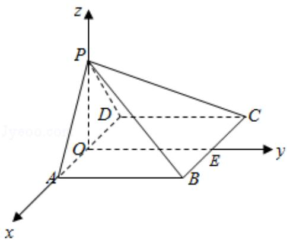

> [!faq]- 2017年全国统一高考数学试卷（理科）（新课标ⅰ）（含解析版）解析
>
> > [!success]- **【答案】** 详见解析
>
> > [!note]- **【分析】**
> > （1）由已知可得 PA⊥AB, PD⊥CD, 再由 AB∥CD, 得 AB⊥PD, 利用线面垂直
>
> > [!note]- **【解析】**
> > 分析】（1）由已知可得 PA⊥AB, PD⊥CD, 再由 AB∥CD, 得 AB⊥PD, 利用线面垂直
> >
> > 的判定可得 AB⊥平面 PAD，进一步得到平面 PAB⊥平面 PAD；
> >
> > (2) 由已知可得四边形 ABCD 为平行四边形，由（1）知 AB⊥平面 PAD，得到
> >
> > AB⊥AD，则四边形ABCD为矩形，设PA=AB=2a，则AD= $2\sqrt{2}$ a.取AD中点O，BC
> >
> > 中点 E，连接 PO、OE，以 O 为坐标原点，分别以 OA、OE、OP 所在直线为 x、y、z
> >
> > 轴建立空间直角坐标系，求出平面 PBC 的一个法向量，再证明 PD⊥平面 PAB，
> >
> > 得 $\overrightarrow{PD}$ 为平面PAB的一个法向量，由两法向量所成角的余弦值可得二面角A-
> >
> > PB-C 的余弦值.
> >
> > 【
> > 解答】（1）证明：∵∠BAP=∠CDP=90°，∴PA⊥AB，PD⊥CD，
> >
> > ∵AB∥CD，∴AB⊥PD，
> >
> > 又∵PA∩PD=P，且 PAC平面 PAD，PDC平面 PAD，
> >
> > ∴AB⊥平面 PAD，又 ABC 平面 PAB，
> >
> > ∴平面 PAB⊥平面 PAD;
> >
> > (2) 解: $\because AB \parallel CD, AB = CD, \therefore$ 四边形ABCD为平行四边形,
> >
> > 由（1）知 AB⊥平面 PAD，∴AB⊥AD，则四边形 ABCD 为矩形，
> >
> > 在 $\triangle APD$ 中，由 PA=PD， $\angle APD=90^{\circ}$ ，可得 $\triangle PAD$ 为等腰直角三角形，
> >
> > 设 PA=AB=2a，则 $AD=2\sqrt{2}a$ .
> >
> > 取 AD 中点 O，BC 中点 E，连接 PO、OE，
> >
> > 以 O 为坐标原点，分别以 OA、OE、OP 所在直线为 x、y、z 轴建立空间直角坐标系，
> >
> > 则： $D(-\sqrt{2}a, 0, 0)$ ， $B(\sqrt{2}a, 2a, 0)$ ， $P(0, 0, \sqrt{2}a)$ ， $C(-\sqrt{2}a, 2a, 0)$ 。
> >
> > $$
> > \overrightarrow {\mathrm{PD}} = (- \sqrt {2} a, 0, - \sqrt {2} a), \overrightarrow {\mathrm{PB}} = (\sqrt {2} a, 2 a, - \sqrt {2} a), \overrightarrow {\mathrm{BC}} = (- 2 \sqrt {2} a, 0, 0).
> > $$
> >
> > 设平面PBC的一个法向量为 $\vec{\mathrm{n}} = (\mathrm{x},\mathrm{y},\mathrm{z})$
> >
> > 由 $\left\{\begin{aligned}\overrightarrow{n}&\cdot\overrightarrow{PB}=0\\ \overrightarrow{n}&\cdot\overrightarrow{BC}=0\end{aligned}\right.$ ，得 $\left\{\begin{aligned}\sqrt{2}ax+2ay-\sqrt{2}az=0\\ -2\sqrt{2}ax=0\end{aligned}\right.$ ，取y=1，得 $\overrightarrow{n}=(0,1,\sqrt{2})$ .
> >
> > ∵AB⊥平面 PAD，ADC⊂平面 PAD，∴AB⊥PD，
> >
> > 又 PD⊥PA，PA∩AB=A，
> >
> > ∴PD⊥平面PAB，则 $\overrightarrow{PD}$ 为平面PAB的一个法向量， $\overrightarrow{PD}=(-\sqrt{2}a,0,-\sqrt{2}a)$ .
> >
> > $\therefore \cos < \overrightarrow{PD}, \overrightarrow{n} > = \frac{\overrightarrow{PD} \cdot \overrightarrow{n}}{|\overrightarrow{PD}| |\overrightarrow{n}|} = \frac{-2a}{2a \times \sqrt{3}} = -\frac{\sqrt{3}}{3}$ .
> >
> > 由图可知，二面角 A-PB-C 为钝角，
> >
> > ∴二面角 A - PB - C 的余弦值为 $\frac{\sqrt{3}}{3}$ .
> >
> > 
> >
> > 【点评】本题考查平面与平面垂直的判定,考查空间想象能力和思维能力,训练了
> >
> > 利用空间向量求二面角的平面角，是中档题.
