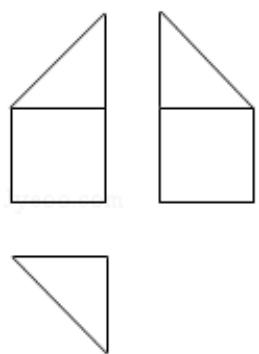

<!-- question-source:start -->
7. (5 分) 某多面体的三视图如图所示, 其中正视图和左视图都由正方形和等腰直角三角形组成, 正方形的边长为 2, 俯视图为等腰直角三角形, 该多面体的各个面中有若干个是梯形, 这些梯形的面积之和为 ( )

A. 10 B. 12 C. 14 D. 16
<!-- question-source:end -->

![[高中/真题/按年份分类/2017/2017年全国统一高考数学试卷_理科__新课标ⅰ__含解析版_/选择题/题目/answers/Q00024342A1.md]]
