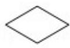
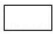
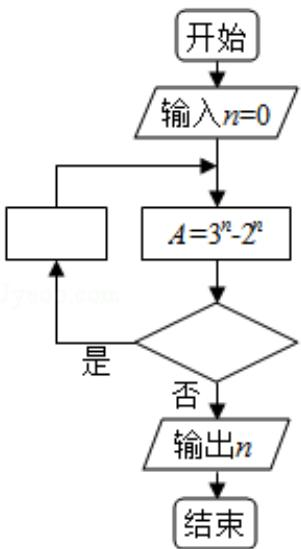

<!-- question-source:start -->
8. （5分）如图程序框图是为了求出满足 $3^{n} - 2^{n} > 1000$ 的最小偶数 $n$ ，那么在

和 □ 两个空白框中，可以分别填入（）

A. $A > 1000$ 和 $n = n + 1$ B. $A > 1000$ 和 $n = n + 2$ C. $A \leq 1000$ 和 $n = n + 1$ D. $A \leq 1000$ 和 $n = n + 2$
<!-- question-source:end -->

![[高中/真题/按年份分类/2017/2017年全国统一高考数学试卷_理科__新课标ⅰ__含解析版_/选择题/题目/answers/Q00024343A1.md]]
