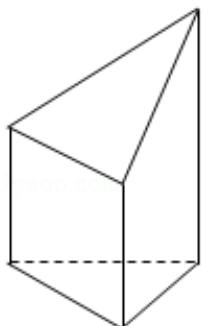

> [!faq]- 2017年全国统一高考数学试卷（理科）（新课标ⅰ）（含解析版）解析
>
> > [!success]- **【答案】** B
>
> > [!note]- **【分析】**
> > 由三视图可得直观图，由图形可知该立体图中只有两个相同的梯形的面，
>
> > [!note]- **【解析】**
> > 分析】由三视图可得直观图，由图形可知该立体图中只有两个相同的梯形的面，
> >
> > 根据梯形的面积公式计算即可
> >
> > 【
> > 解答】解：由三视图可画出直观图，
> >
> > 该立体图中只有两个相同的梯形的面，
> >
> > $$
> > S _ {\text {梯形}} = \frac {1}{2} \times 2 \times (2 + 4) = 6,
> > $$
> >
> > ∴这些梯形的面积之和为 $6 \times 2 = 12$ ，
> >
> > 故选：B.
> >
> > 
> >
> > 【点评】本题考查了体积计算公式，考查了推理能力与计算能力，属于中档题.
