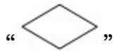
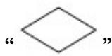
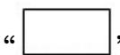

> [!faq]- 2017年全国统一高考数学试卷（理科）（新课标ⅰ）（含解析版）解析
>
> > [!success]- **【答案】** D
>
> > [!note]- **【分析】**
> > 通过要求 A>1000 时输出且框图中在 “否” 时输出确定 “√”
>
> > [!note]- **【解析】**
> > 分析】通过要求 A>1000 时输出且框图中在 “否” 时输出确定 “√”
> >
> > 
> >
> > 不能输入 “A>1000”，进而通过偶数的特征确定 $n=n+2$ .
> >
> > 【
> > 解答】解：因为要求 A>1000 时输出，且框图中在 “否” 时输出，
> >
> > 所以
> >
> > 
> >
> > $$
> > " A > 1 0 0 0"
> > $$
> >
> > 又要求 n 为偶数，且 n 的初始值为 0，
> >
> > 
> >
> > 所以 “☐” 中 n 依次加 2 可保证其为偶数，
> >
> > 所以 D 选项满足要求，
> >
> > 故选：D.
> >
> > 【点评】本题考查程序框图，属于基础题，意在让大部分考生得分.
