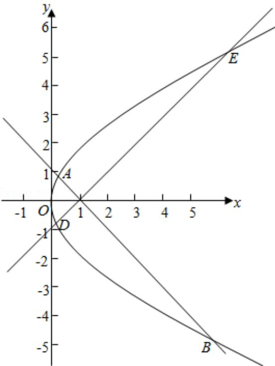

> [!faq]- 2017年全国统一高考数学试卷（理科）（新课标ⅰ）（含解析版）解析
>
> > [!success]- **【答案】** A
>
> > [!note]- **【分析】**
> > 方法一: 根据题意可判断当 A 与 D, B, E 关于 x 轴对称, 即直线 DE 的斜率
>
> > [!note]- **【解析】**
> > 分析】方法一: 根据题意可判断当 A 与 D, B, E 关于 x 轴对称, 即直线 DE 的斜率
> >
> > 为 1， $|AB| + |DE|$ 最小，根据弦长公式计算即可.
> >
> > 方法二：设直线 $I_{1}$ 的倾斜角为 $\theta$ ，则 $I_{2}$ 的倾斜角为 $\frac{\pi}{2} + \theta$ ，利用焦点弦的弦长公式分别表示出 $|AB|$ ， $|DE|$ ，整理求得
> > 答案
> >
> > 【
> > 解答】解：如图， $I_{1} \perp I_{2}$ ，直线 $I_{1}$ 与C交于A、B两点，
> >
> > 直线 $I_{2}$ 与C交于D、E两点，
> >
> > 要使 $|AB|+|DE|$ 最小，
> >
> > 则 A 与 D，B，E 关于 x 轴对称，即直线 DE 的斜率为 1，
> >
> > 又直线 $I_{2}$ 过点（1，0），
> >
> > 则直线 $I_{2}$ 的方程为 y=x-1，
> >
> > 联立方程组 $\left\{\begin{aligned}y^{2}&=4x\\ y&=x-1\end{aligned}\right.$ ，则 $y^{2}-4y-4=0$ ，
> >
> > $$
> > \therefore \mathrm{y} _ {1} + \mathrm{y} _ {2} = 4, \quad \mathrm{y} _ {1} \mathrm{y} _ {2} = - 4,
> > $$
> >
> > $$
> > \therefore | D E | = \sqrt {1 + \frac {1}{k ^ {2}}} \cdot | y _ {1} - y _ {2} | = \sqrt {2} \times \sqrt {3 2} = 8,
> > $$
> >
> > $\therefore |AB| + |DE|$ 的最小值为 2 | DE| = 16,
> >
> > 方法二：设直线 $I_{1}$ 的倾斜角为 $\theta$ ，则 $I_{2}$ 的倾斜角为 $\frac{\pi}{2} + \theta$ ，
> >
> > 根据焦点弦长公式可得 $|AB| = \frac{2p}{\sin^2\theta} = \frac{4}{\sin^2\theta}$
> >
> > $$
> > \left| D E \right| = \frac {2 p}{\sin^ {2} \left(\frac {\pi}{2} + \theta\right)} = \frac {2 p}{\cos^ {2} \theta} = \frac {4}{\cos^ {2} \theta}
> > $$
> >
> > $$
> > \therefore | A B | + | D E | = \frac {4}{\sin^ {2} \theta} + \frac {4}{\cos^ {2} \theta} = \frac {4}{\sin^ {2} \theta \cos^ {2} \theta} = \frac {1 6}{\sin^ {2} 2 \theta},
> > $$
> >
> > $$
> > \because 0 <   \sin^ {2} 2 \theta \leq 1,
> > $$
> >
> > ∴当 $\theta=45^{\circ}$ 时， $|AB|+|DE|$ 的最小，最小为 16，
> >
> > 故选：A.
> >
> > 
> >
> > 【点评】本题考查了抛物线的简单性质以及直线和抛物线的位置关系, 弦长公式,
> > 对于过焦点的弦, 能熟练掌握相关的结论, 解决问题事半功倍属于中档题.
