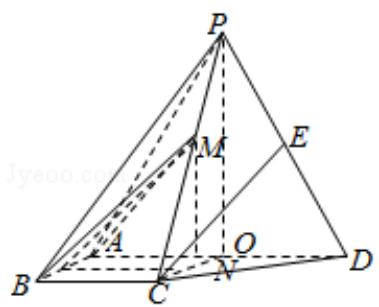
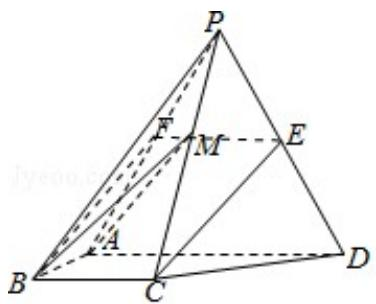

> [!faq]- 2017年全国统一高考数学试卷（理科）（新课标ⅱ）（含解析版）解析
>
> > [!success]- **【答案】** （12分）如图，四棱锥P-ABCD中，侧面PAD为等边三角形且垂直于底面ABCD， $AB=BC=\frac{1}{2}AD$ ， $\angle BAD=\angle ABC=90^{\circ}$ ，E是PD的中点
>
> > [!note]- **【分析】**
> > （1）取 PA 的中点 F，连接 EF，BF，通过证明 CE∥BF，利用直线与平面平行
>
> > [!note]- **【解析】**
> > （1）证明：取 PA 的中点 F，连接 EF，BF，因为 E 是 PD 的中点，
> >
> > 所以 $EF \parallel \frac{1}{2} AD$ ， $AB = BC = \frac{1}{2} AD$ ， $\angle BAD = \angle ABC = 90^{\circ}$ ， $\therefore BC \parallel \frac{1}{2} AD$ ，
> >
> > ∴BCEF 是平行四边形，可得 CE∥BF，BFC平面 PAB，CE∉平面 PAB，
> >
> > ∴直线 CE∥平面 PAB;
> > (2) 解: 四棱锥 P - ABCD 中,
> >
> > 侧面 PAD 为等边三角形且垂直于底面 ABCD， $AB=BC=\frac{1}{2}AD$ ，
> >
> > $\angle BAD=\angle ABC=90^{\circ}$ ，E 是 PD 的中点.
> >
> > 取 AD 的中点 O, M 在底面 ABCD 上的射影 N 在 OC 上, 设 AD=2, 则 AB=BC=1, OP=
> >
> > $$
> > \sqrt {3},
> > $$
> >
> > ∴∠PCO=60°，直线BM与底面ABCD所成角为45°，
> >
> > 可得：BN=MN， $CN=\frac{\sqrt{3}}{3}MN$ ，BC=1，
> >
> > 可得： $1+\frac{1}{3}BN^{2}=BN^{2}$ ， $BN=\frac{\sqrt{6}}{2}$ ， $MN=\frac{\sqrt{6}}{2}$
> >
> > 作 NQ⊥AB 于 Q，连接 MQ，AB⊥MN，
> >
> > 所以 $\angle$ MQN 就是二面角 M-AB-D 的平面角， $MQ = \sqrt{1^2 + (\frac{\sqrt{6}}{2})^2}$ $= \frac{\sqrt{10}}{2},$
> >
> > 二面角 M - AB - D 的余弦值为： $\frac{\frac{1}{\sqrt{10}}}{2}=\frac{\sqrt{10}}{5}$ .
> >
> > 
> >
> > 
