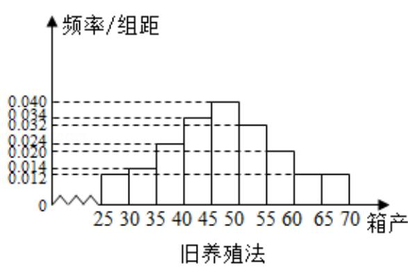
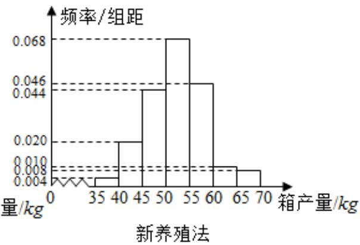

<!-- question-source:start -->
18. (12 分) 海水养殖场进行某水产品的新、旧网箱养殖方法的产量对比, 收获时

各随机抽取了 100 个网箱，测量各箱水产品的产量（单位：kg），其频率分布直

方图如图：

(1) 设两种养殖方法的箱产量相互独立, 记 A 表示事件 “旧养殖法的箱产量低于

50kg，新养殖法的箱产量不低于 50kg”，估计 A 的概率；

(2) 填写下面列联表，并根据列联表判断是否有 $99\%$ 的把握认为箱产量与养殖方

法有关：

<table><tr><td></td><td>箱产量&lt;50kg</td><td>箱产量≥50kg</td></tr><tr><td>旧养殖法</td><td></td><td></td></tr><tr><td>新养殖法</td><td></td><td></td></tr></table>

(3) 根据箱产量的频率分布直方图, 求新养殖法箱产量的中位数的估计值 (精确

到0.01）.

附：

<table><tr><td>P (K2≥k)</td><td>0.050</td><td>0.010</td><td>0.001</td></tr><tr><td>k</td><td>3.841</td><td>6.635</td><td>10.828</td></tr></table>

$$
K ^ {2} = \frac {\mathrm{n} (\mathrm{ad} - \mathrm{bc}) ^ {2}}{(\mathrm{a} + \mathrm{b}) (\mathrm{c} + \mathrm{d}) (\mathrm{a} + \mathrm{c}) (\mathrm{b} + \mathrm{d})}.
$$
<!-- question-source:end -->

![[高中/真题/按年份分类/2017/2017年全国统一高考数学试卷_理科__新课标ⅱ__含解析版_/解答题/题目/answers/Q00027233A1.md]]
