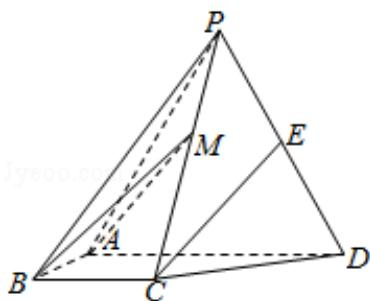

<!-- question-source:start -->
19. （12分）如图，四棱锥P-ABCD中，侧面PAD为等边三角形且垂直于底面ABCD， $AB=BC=\frac{1}{2}AD$ ， $\angle BAD=\angle ABC=90^{\circ}$ ，E是PD的中点.

(1) 证明: 直线 CE∥平面 PAB;

(2) 点 M 在棱 PC 上, 且直线 BM 与底面 ABCD 所成角为 $45^{\circ}$ , 求二面角 M - AB - D 的余弦值.

<!-- question-source:end -->

![[高中/真题/按年份分类/2017/2017年全国统一高考数学试卷_理科__新课标ⅱ__含解析版_/解答题/题目/answers/Q00027234A1.md]]
