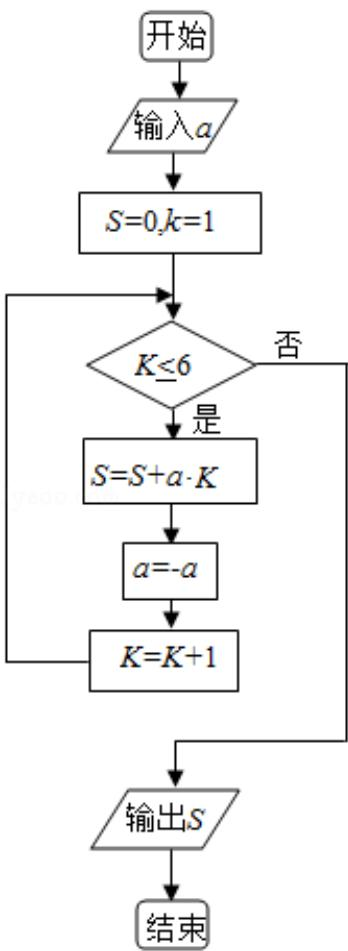

<!-- question-source:start -->
8. （5分）执行如图的程序框图，如果输入的 $a = -1$ ，则输出的 $S =$ （ ）

A. 2 B. 3 C. 4 D. 5
<!-- question-source:end -->

![[高中/真题/按年份分类/2017/2017年全国统一高考数学试卷_理科__新课标ⅱ__含解析版_/选择题/题目/answers/Q00027502A1.md]]
