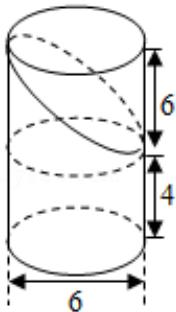

> [!faq]- 2017年全国统一高考数学试卷（理科）（新课标ⅱ）（含解析版）解析
>
> > [!success]- **【答案】** B
>
> > [!note]- **【分析】**
> > 由三视图可得, 直观图为一个完整的圆柱减去一个高为 6 的圆柱的一半,
> > 即可求出几何体的体积.
>
> > [!note]- **【解析】**
> > 解: 由三视图可得, 直观图为一个完整的圆柱减去一个高为 6 的圆柱的一半,
> >
> > $$
> > V = \pi \bullet 3 ^ {2} \times 1 0 - \frac {1}{2} \bullet \pi \bullet 3 ^ {2} \times 6 = 6 3 \pi ,
> > $$
> >
> > 故选：B.
> >
> > 
> >
> > 【点评】本题考查了体积计算公式，考查了推理能力与计算能力，属于中档题.
