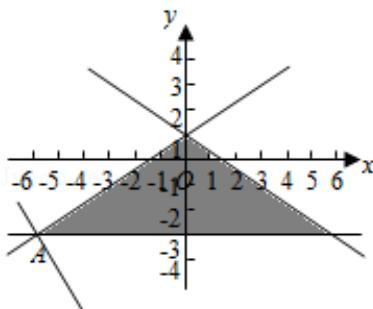

> [!faq]- 2017年全国统一高考数学试卷（理科）（新课标ⅱ）（含解析版）解析
>
> > [!success]- **【答案】** A
>
> > [!note]- **【分析】**
> > 画出约束条件的可行域，利用目标函数的最优解求解目标函数的最小值
>
> > [!note]- **【解析】**
> > 解：x、y 满足约束条件 $\left\{\begin{aligned}&2x+3y-3\leqslant0\\ &2x-3y+3\geqslant0\\ &y+3\geqslant0\end{aligned}\right.$ 的可行域如图：
> >
> > $z=2x+y$ 经过可行域的 A 时，目标函数取得最小值，
> >
> > 由 $\left\{\begin{aligned}y&=-3\\ 2x&-3y+3=0\end{aligned}\right.$ 解得A $(-6,-3)$ ，
> >
> > 则 $z = 2x + y$ 的最小值是：-15.
> >
> > 故选：A.
> >
> > 
> >
> > 【点评】本题考查线性规划的简单应用，考查数形结合以及计算能力.
