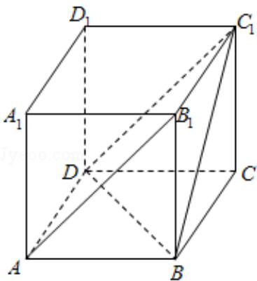
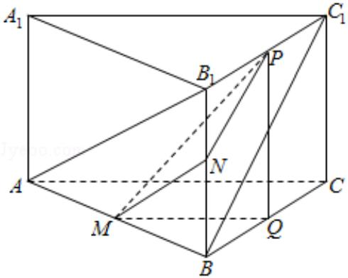

> [!faq]- 2017年全国统一高考数学试卷（理科）（新课标ⅱ）（含解析版）解析
>
> > [!success]- **【答案】** C
>
> > [!note]- **【分析】**
> > 【解法一】设 M、N、P 分别为 AB，BB₁ 和 B₁C₁ 的中点，得出 AB₁、BC₁ 夹角为
>
> > [!note]- **【解析】**
> > 解：【解法一】如图所示，设 M、N、P 分别为 AB， $BB_{1}$ 和 $B_{1}C_{1}$ 的中点，则 $AB_{1}$ 、 $BC_{1}$ 夹角为 MN 和 NP 夹角或其补角
> >
> > (因异面直线所成角为 $(0, \frac{\pi}{2}]$ ，
> >
> > 可知 $MN=\frac{1}{2}AB_{1}=\frac{\sqrt{5}}{2}$ ,
> >
> > $$
> > N P = \frac {1}{2} B C _ {1} = \frac {\sqrt {2}}{2};
> > $$
> >
> > 作 BC 中点 Q，则 $\triangle PQM$ 为直角三角形；
> >
> > $$
> > \because P Q = 1, M Q = \frac {1}{2} A C,
> > $$
> >
> > △ABC 中，由余弦定理得
> >
> > $$
> > A C ^ {2} = A B ^ {2} + B C ^ {2} - 2 A B \cdot B C \cdot \cos \angle A B C
> > $$
> >
> > $$
> > = 4 + 1 - 2 \times 2 \times 1 \times \left(- \frac {1}{2}\right)
> > $$
> >
> > =7,
> >
> > $$
> > \therefore A C = \sqrt {7},
> > $$
> >
> > $$
> > \therefore M Q = \frac {\sqrt {7}}{2};
> > $$
> >
> > 在 $\triangle$ MQP中， $MP=\sqrt{MQ^{2}+PQ^{2}}=\frac{\sqrt{11}}{2}$ ；
> >
> > 在 $\triangle PMN$ 中，由余弦定理得
> >
> > $$
> > \cos \angle M N P = \frac {M N ^ {2} + N P ^ {2} - P M ^ {2}}{2 \cdot M N \cdot N P} = \frac {\left(\frac {\sqrt {5}}{2}\right) ^ {2} + \left(\frac {\sqrt {2}}{2}\right) ^ {2} - \left(\frac {\sqrt {1 1}}{2}\right) ^ {2}}{2 \times \frac {\sqrt {5}}{2} \times \frac {\sqrt {2}}{2}} = - \frac {\sqrt {1 0}}{5};
> > $$
> >
> > 又异面直线所成角的范围是 $(0, \frac{\pi}{2}]$ ,
> >
> > $\therefore AB_{1}$ 与 $BC_{1}$ 所成角的余弦值为 $\frac{\sqrt{10}}{5}$ .
> >
> > 【解法二】如图所示，
> >
> > 
> >
> > 补成四棱柱 ABCD - A₁B₁C₁D₁，求 ∠BC₁D 即可；
> >
> > $$
> > B C _ {1} = \sqrt {2}, B D = \sqrt {2 ^ {2} + 1 ^ {2} - 2 \times 2 \times 1 \times \cos 6 0 ^ {\circ}} = \sqrt {3},
> > $$
> >
> > $C_{1}D=\sqrt{5},$
> >
> > $$
> > \therefore \mathrm{BC} _ {1} ^ {2} + \mathrm{BD} ^ {2} = \mathrm{C} _ {1} \mathrm{D} ^ {2},
> > $$
> >
> > $\therefore \angle DBC_{1} = 90^{\circ},$
> >
> > $$
> > \therefore \cos \angle B C _ {1} D = \frac {\sqrt {2}}{\sqrt {5}} = \frac {\sqrt {1 0}}{5}.
> > $$
> >
> > 故选：C.
> >
> > 
> >
> > 【点评】本题考查了空间中的两条异面直线所成角的计算问题，也考查了空间中
> > 的平行关系应用问题，是中档题.
