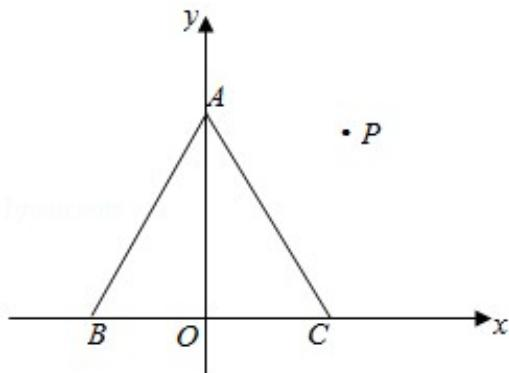

> [!faq]- 2017年全国统一高考数学试卷（理科）（新课标ⅱ）（含解析版）解析
>
> > [!success]- **【答案】** B
>
> > [!note]- **【分析】**
> > 根据条件建立坐标系,求出点的坐标,利用坐标法结合向量数量积的公式
>
> > [!note]- **【解析】**
> > 解：建立如图所示的坐标系，以 BC 中点为坐标原点，
> >
> > 则 A $(0, \sqrt{3})$ ，B $(-1, 0)$ ，C $(1, 0)$ ，
> >
> > 设 P (x, y)，则 $\overrightarrow{PA} = (-x, \sqrt{3} - y)$ ， $\overrightarrow{PB} = (-1 - x, -y)$ ， $\overrightarrow{PC} = (1 - x, -y)$ ，
> >
> > $$
> > \overrightarrow {\mathrm{PA}} \cdot (\overrightarrow {\mathrm{PB}} + \overrightarrow {\mathrm{PC}}) = 2 x ^ {2} - 2 \sqrt {3} y + 2 y ^ {2} = 2 \left[ x ^ {2} + \left(y - \frac {\sqrt {3}}{2}\right) ^ {2} - \frac {3}{4} \right]
> > $$
> >
> > ∴当 $x=0,\quad y=\frac{\sqrt{3}}{2}$ 时，取得最小值 $2\times\left(-\frac{3}{4}\right)=-\frac{3}{2}$
> >
> > 故选：B.
> >
> > 
> >
> > 【点评】本题主要考查平面向量数量积的应用,根据条件建立坐标系,利用坐标法
> >
> > 是解决本题的关键.
> >
> > ##
> > 二、填空题：本题共4小题，每小题5分，共20分。
