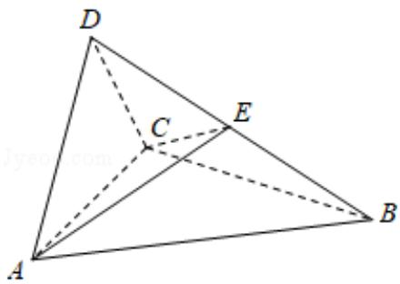

<!-- question-source:start -->
19. (12 分) 如图, 四面体 ABCD 中, $\triangle ABC$ 是正三角形, $\triangle ACD$ 是直角三角形,

$$
\angle A B D = \angle C B D, A B = B D.
$$

(1) 证明: 平面 ACD⊥平面 ABC;

(2) 过 AC 的平面交 BD 于点 E，若平面 AEC 把四面体 ABCD 分成体积相等的两部

分，求二面角 D-AE-C 的余弦值.

<!-- question-source:end -->

![[高中/真题/按年份分类/2017/2017年全国统一高考数学试卷_理科__新课标ⅲ__含解析版_/填空题/题目/answers/Q00024069A1.md]]
