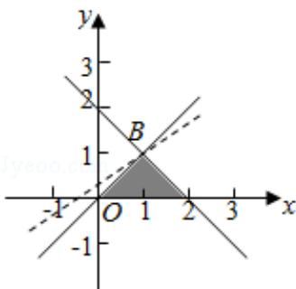

> [!faq]- 2017年全国统一高考数学试卷（理科）（新课标ⅲ）（含解析版）解析
>
> > [!success]- **【答案】** -1
>
> > [!note]- **【分析】**
> > 作出不等式组对应的平面区域，利用目标函数的几何意义，求目标函数
>
> > [!note]- **【解析】**
> > 解：由 $z = 3x - 4y$ ，得 $y = \frac{3}{4} x - \frac{z}{4}$ ，作出不等式对应的可行域（阴影部分），平移直线 $y = \frac{3}{4} x - \frac{z}{4}$ ，由平移可知当直线 $y = \frac{3}{4} x - \frac{z}{4}$
> >
> > 经过点B（1，1）时，直线 $y = \frac{3}{4} x - \frac{z}{4}$ 的截距最大，此时 $z$ 取得最小值，
> >
> > 将 B 的坐标代入 z=3x - 4y=3 - 4=-1，
> >
> > 即目标函数 z=3x-4y 的最小值为 -1.
> >
> > 故答案为：-1.
> >
> > 
