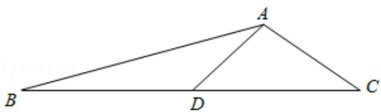

> [!faq]- 2017年全国统一高考数学试卷（理科）（新课标ⅲ）（含解析版）解析
>
> > [!success]- **【答案】** 详见解析
>
> > [!note]- **【分析】**
> > （1）先根据同角的三角函数的关系求出 A，再根据余弦定理即可求出，
> > (2) 先根据夹角求出 $\cos C$ ，求出 $CD$ 的长，得到 $S_{\triangle ABD} = \frac{1}{2} S_{\triangle ABC}$ .
>
> > [!note]- **【解析】**
> > 解：（1）∵ $\sin A+\sqrt{3}\cos A=0$ ，
> >
> > $\therefore \tan A = -\sqrt{3},$
> >
> > $\because 0 < A < \pi,$
> >
> > $\therefore A = \frac{2\pi}{3},$
> >
> > 由余弦定理可得 $a^{2}=b^{2}+c^{2}-2bccosA$ ,
> >
> > 即 $28=4+c^{2}-2\times2c\times\left(-\frac{1}{2}\right)$ ，
> >
> > 即 $c^{2}+2c-24=0$ ，
> >
> > 解得 c = -6 （舍去）或 c = 4，
> >
> > 故 c=4.
> > (2) $\because c^{2}=b^{2}+a^{2}-2ab\cos C,$
> >
> > $$
> > \therefore 1 6 = 2 8 + 4 - 2 \times 2 \sqrt {7} \times 2 \times \cos C,
> > $$
> >
> > $$
> > \therefore \cos C = \frac {2}{\sqrt {7}},
> > $$
> >
> > $$
> > \therefore C D = \frac {A C}{\cos C} = \frac {\frac {2}{2}}{\sqrt {7}} = \sqrt {7}
> > $$
> >
> > $$
> > \therefore C D = \frac {1}{2} B C
> > $$
> >
> > $$
> > \because S _ {\triangle A B C} = \frac {1}{2} A B \cdot A C \cdot \sin \angle B A C = \frac {1}{2} \times 4 \times 2 \times \frac {\sqrt {3}}{2} = 2 \sqrt {3},
> > $$
> >
> > $$
> > \therefore S _ {\triangle A B D} = \frac {1}{2} S _ {\triangle A B C} = \sqrt {3}
> > $$
> >
> > 
> >
> > 【点评】本题考查了余弦定理和三角形的面积公式，以及解三角形的问题，属于中
> >
> > 档题
