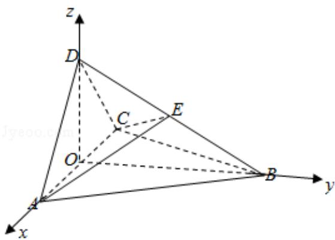

> [!faq]- 2017年全国统一高考数学试卷（理科）（新课标ⅲ）（含解析版）解析
>
> > [!success]- **【答案】** （12 分）如图，四面体 ABCD 中， $\triangle ABC$ 是正三角形， $\triangle ACD$ 是直角三角形，
>
> > [!note]- **【分析】**
> > （1）如图所示，取 AC 的中点 O，连接 BO，OD. $\triangle ABC$ 是等边三角形，可得
>
> > [!note]- **【解析】**
> > （1）证明：如图所示，取 AC 的中点 O，连接 BO，OD.
> >
> > ∵△ABC 是等边三角形，∴OB⊥AC.
> >
> > $\triangle ABD$ 与 $\triangle CBD$ 中，AB=BD=BC， $\angle ABD=\angle CBD$ ，
> >
> > $\therefore\triangle ABD\cong\triangle CBD,\quad\therefore AD=CD.$
> >
> > ∵△ACD 是直角三角形，
> >
> > ∴AC 是斜边，∴∠ADC=90°.
> >
> > $\therefore DO=\frac{1}{2}AC.$
> >
> > $$
> > \therefore D O ^ {2} + B O ^ {2} = A B ^ {2} = B D ^ {2}.
> > $$
> >
> > $$
> > \therefore \angle B O D = 9 0 ^ {\circ}.
> > $$
> >
> > ∴OB⊥OD.
> >
> > 又 DO∩AC=O，∴OB⊥平面 ACD.
> >
> > 又 OBC 平面 ABC,
> >
> > ∴平面 ACD⊥平面 ABC.
> > (2) 解：设点 D，B 到平面 ACE 的距离分别为 $h_{D}$ ， $h_{E}$ 。则 $\frac{h_{D}}{h_{E}} = \frac{DE}{BE}$ .
> >
> > ∵平面 AEC 把四面体 ABCD 分成体积相等的两部分，
> >
> > $$
> > \therefore \frac {\frac {1}{3} S _ {\triangle A C E} \cdot h _ {D}}{\frac {1}{3} S _ {\triangle A C E} \cdot h _ {E}} = \frac {h _ {D}}{h _ {E}} = \frac {D E}{B E} = 1.
> > $$
> >
> > ∴点 E 是 BD 的中点.
> >
> > 建立如图所示的空间直角坐标系．不妨取 AB=2．
> >
> > 则 $O(0, 0, 0)$ , $A(1, 0, 0)$ , $C(-1, 0, 0)$ , $D(0, 0, 1)$ , $B(0, \sqrt{3}, 0)$ , $E$
> >
> > $(0, \frac{\sqrt{3}}{2}, \frac{1}{2})$ .
> >
> > $\overrightarrow{\mathrm{AD}} = (-1, 0, 1)$ , $\overrightarrow{\mathrm{AE}} = (-1, \frac{\sqrt{3}}{2}, \frac{1}{2})$ , $\overrightarrow{\mathrm{AC}} = (-2, 0, 0)$ .
> >
> > 设平面 ADE 的法向量为 $\vec{\pi} = (x, y, z)$ ，则 $\left\{\begin{aligned}\vec{m} & \cdot \overrightarrow{AD} = 0 \\ \vec{m} & \cdot \overrightarrow{AE} = 0\end{aligned}\right.$ ，即 $\left\{\begin{aligned}-x + z &= 0 \\ -x + \frac{\sqrt{3}}{2}y + \frac{1}{2}z &= 0\end{aligned}\right.$ ，取 $\vec{\pi}=$ (3, $\sqrt{3}$ , 3).
> >
> > 同理可得：平面 ACE 的法向量为 $\vec{n}=(0,1,-\sqrt{3})$ .
> >
> > $$
> > \therefore \cos <   \vec {m}, \vec {n} > = \frac {\vec {m} \cdot \vec {n}}{| \vec {m} | | \vec {n} |} = \frac {- 2 \sqrt {3}}{\sqrt {2 1} \times 2} = - \frac {\sqrt {7}}{7}.
> > $$
> >
> > ∴二面角 D-AE-C 的余弦值为 $\frac{\sqrt{7}}{7}$ .
> >
> > 
