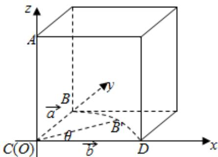

> [!faq]- 2017年全国统一高考数学试卷（理科）（新课标ⅲ）（含解析版）解析
>
> > [!success]- **【答案】** 为：②③.  【点评】本题考查命题真假的判断，考查空间中线线、线面、面面间的位置关系等 基础知识，考查推理论证能力、运算求解能力、空间想象能力，考查数形结合 思想、化归与转化思想，是中档题。 ##
>
> > [!note]- **【分析】**
> > 由题意知，a、b、AC三条直线两两相互垂直，构建如图所示的边长为1的
>
> > [!note]- **【解析】**
> > 分析】由题意知，a、b、AC三条直线两两相互垂直，构建如图所示的边长为1的
> >
> > 正方体， $|AC|=1$ ， $|AB|=\sqrt{2}$ ，斜边AB以直线AC为旋转轴，则A点保持不变，B
> >
> > 点的运动轨迹是以 C 为圆心，1 为半径的圆，以 C 坐标原点，以 CD 为 x 轴，CB
> >
> > 为 y 轴，CA 为 z 轴，建立空间直角坐标系，利用向量法能求出结果.
> >
> > 【
> > 解答】解：由题意知，a、b、AC三条直线两两相互垂直，画出图形如图，
> >
> > 不妨设图中所示正方体边长为 1，
> >
> > 故 $|AC|=1,\quad|AB|=\sqrt{2},\backslash$
> >
> > 斜边 AB 以直线 AC 为旋转轴，则 A 点保持不变，
> >
> > B 点的运动轨迹是以 C 为圆心，1 为半径的圆，
> >
> > 以 C 坐标原点，以 CD 为 x 轴，CB 为 y 轴，CA 为 z 轴，建立空间直角坐标系，
> >
> > 则 D（1，0，0），A（0，0，1），直线 a 的方向单位向量 $\vec{a} = (0, 1, 0)$ ， $|\vec{a}| = 1$ ，
> >
> > 直线 b 的方向单位向量 $\vec{b} = (1, 0, 0)$ ， $|\vec{b}| = 1$ ，
> >
> > 设 B 点在运动过程中的坐标中的坐标 $B'$ （ $\cos\theta$ ， $\sin\theta$ ，0），
> >
> > 其中 $\theta$ 为 B'C 与 CD 的夹角， $\theta\in[0,2\pi)$ ，
> >
> > $\therefore AB'$ 在运动过程中的向量， $\overrightarrow{AB'} = (\cos \theta, \sin \theta, -1)$ ， $|\overrightarrow{AB'}| = \sqrt{2}$ ，
> >
> > 设 $\overrightarrow{\mathrm{AB}^{\prime}}$ 与 $\vec{a}$ 所成夹角为 $a\in [0,\frac{\pi}{2} ]$
> >
> > 则 $\cos\alpha=\frac{|\left(-\cos\theta,-\sin\theta,1\right)\cdot(0,1,0)|}{|\vec{a}|\cdot|\overrightarrow{AB^{\prime}}|}=\frac{\sqrt{2}}{2}|\sin\theta|\in[0,\frac{\sqrt{2}}{2}],$
> >
> > $\therefore a \in [\frac{\pi}{4}, \frac{\pi}{2}]$ ，∴③正确，④错误.
> >
> > 设 $\overrightarrow{AB^{\prime}}$ 与 $\vec{b}$ 所成夹角为 $\beta \in [0, \frac{\pi}{2}]$ ,
> >
> > $$
> > \cos \beta = \frac {\left| \overrightarrow {A B ^ {\prime}} \cdot \overrightarrow {b} \right|}{\left| \overrightarrow {A B ^ {\prime}} \right| \cdot \left| \overrightarrow {b} \right|} = \frac {\left| (- \cos \theta , \sin \theta , 1) \cdot (1 , 0 , 0) \right|}{\left| \overrightarrow {b} \right| \cdot \left| \overrightarrow {A B ^ {\prime}} \right|} = \frac {\sqrt {2}}{2} | \cos \theta |,
> > $$
> >
> > 当 $\overrightarrow{AB}^{\prime}$ 与 $\vec{a}$ 夹角为 $60^{\circ}$ 时，即 $a = \frac{\pi}{3}$ ，
> >
> > $$
> > \left| \sin \theta \right| = \sqrt {2} \cos \alpha = \sqrt {2} \cos \frac {\pi}{3} = \frac {\sqrt {2}}{2},
> > $$
> >
> > $$
> > \because \cos^ {2} \theta + \sin^ {2} \theta = 1, \therefore \cos \beta = \frac {\sqrt {2}}{2} | \cos \theta | = \frac {1}{2},
> > $$
> >
> > $\because \beta \in [0, \frac{\pi}{2}], \therefore \beta = \frac{\pi}{3}$ ，此时 $\overrightarrow{AB}^{\prime}$ 与 $\vec{b}$ 的夹角为 $60^{\circ}$ ，
> >
> > ∴② 正确，①错误.
> >
> > 故
> > 答案为：②③.
> >
> > 
> >
> > 【点评】本题考查命题真假的判断，考查空间中线线、线面、面面间的位置关系等
> >
> > 基础知识，考查推理论证能力、运算求解能力、空间想象能力，考查数形结合
> >
> > 思想、化归与转化思想，是中档题。
> >
> > ##
