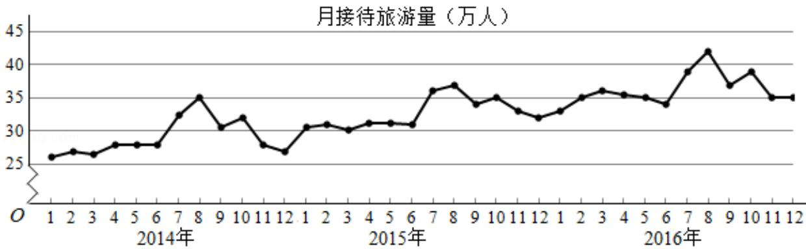

<!-- question-source:start -->
3. (5 分) 某城市为了解游客人数的变化规律, 提高旅游服务质量, 收集并整理了
2014 年 1 月至 2016 年 12 月期间月接待游客量（单位：万人）的数据，绘制了
下面的折线图.

根据该折线图，下列结论错误的是（）

A. 月接待游客量逐月增加
B. 年接待游客量逐年增加
C. 各年的月接待游客量高峰期大致在 7,8 月
D. 各年 1 月至 6 月的月接待游客量相对于 7 月至 12 月，波动性更小，变化比

较平稳
<!-- question-source:end -->

![[高中/真题/按年份分类/2017/2017年全国统一高考数学试卷_理科__新课标ⅲ__含解析版_/选择题/题目/answers/Q00024053A1.md]]
