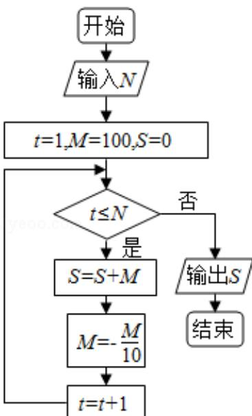

<!-- question-source:start -->
7. (5 分) 执行如图的程序框图, 为使输出 S 的值小于 91, 则输入的正整数 N 的最
小值为（）

A. 5 B. 4 C. 3 D. 2
<!-- question-source:end -->

![[高中/真题/按年份分类/2017/2017年全国统一高考数学试卷_理科__新课标ⅲ__含解析版_/选择题/题目/answers/Q00024057A1.md]]
