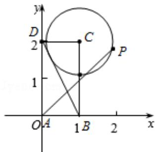

> [!faq]- 2017年全国统一高考数学试卷（理科）（新课标ⅲ）（含解析版）解析
>
> > [!success]- **【答案】** A
>
> > [!note]- **【分析】**
> > 如图: 以 A 为原点, 以 AB, AD 所在的直线为 x, y 轴建立如图所示的坐标系,
> > 先求出圆的标准方程, 再设点 P 的坐标为 $\left(\frac{2\sqrt{5}}{5}\cos\theta+1,\frac{2\sqrt{5}}{5}\sin\theta+2\right)$ , 根据 $\overrightarrow{AP}$ $=\lambda\overrightarrow{AB}+\mu\overrightarrow{AD}$ ，求出 $\lambda,\mu$ ，根据三角函数的性质即可求出最值.
>
> > [!note]- **【解析】**
> > 解: 如图: 以 A 为原点, 以 AB, AD 所在的直线为 x, y 轴建立如图所示的坐
> >
> > 标系，
> >
> > 则 A（0，0），B（1，0），D（0，2），C（1，2），
> >
> > ∵动点 P 在以点 C 为圆心且与 BD 相切的圆上，
> >
> > 设圆的半径为 r，
> >
> > ∵BC=2, CD=1,
> >
> > $$
> > \therefore B D = \sqrt {2 ^ {2} + 1 ^ {2}} = \sqrt {5}
> > $$
> >
> > $$
> > \therefore \frac {1}{2} B C \bullet C D = \frac {1}{2} B D \bullet r,
> > $$
> >
> > $$
> > \therefore r = \frac {2}{\sqrt {5}},
> > $$
> >
> > ∴圆的方程为 $(x-1)^{2}+(y-2)^{2}=\frac{4}{5}$ ,
> >
> > 设点P的坐标为 $\left(\frac{2\sqrt{5}}{5}\cos \theta +1,\frac{2\sqrt{5}}{5}\sin \theta +2\right)$
> >
> > $$
> > \because \overrightarrow {A P} = \lambda \overrightarrow {A B} + \mu \overrightarrow {A D},
> > $$
> >
> > $$
> > \therefore \left(\frac {2 \sqrt {5}}{5} \cos \theta + 1, \frac {2 \sqrt {5}}{5} \sin \theta + 2\right) = \lambda (1, 0) + \mu (0, 2) = (\lambda , 2 \mu),
> > $$
> >
> > $$
> > \therefore \frac {2 \sqrt {5}}{5} \cos \theta + 1 = \lambda , \frac {2 \sqrt {5}}{5} \sin \theta + 2 = 2 \mu ,
> > $$
> >
> > $\therefore \lambda + \mu = \frac{2\sqrt{5}}{5}\cos \theta + \frac{\sqrt{5}}{5}\sin \theta + 2 = \sin (\theta + \varphi) + 2$ ，其中 $\tan \varphi = 2$
> >
> > $$
> > \because - 1 \leq \sin (\theta + \varphi) \leqslant 1,
> > $$
> >
> > $$
> > \therefore 1 \leq \lambda + \mu \leq 3,
> > $$
> >
> > 故 $\lambda + \mu$ 的最大值为 3，
> >
> > 故选：A.
> >
> > 
> >
> > 【点评】本题考查了向量的坐标运算以及圆的方程和三角函数的性质，关键是设
> >
> > 点 P 的坐标，考查了学生的运算能力和转化能力，属于中档题.
> >
> > ##
> > 二、填空题:本题共4小题，每小题5分，共20分。
