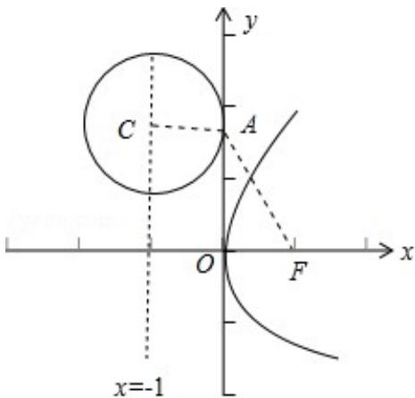

> [!faq]- 2017年天津高考文科数学试题及答案(Word版)解析
>
> > [!success]- **【答案】** 为： $(x + 1)^2 + (y - \sqrt{3})^2 = 1$ .  【点评】本题主要考查求圆的标准方程的方法, 抛物线的简单几何性质, 属于中档 题.
>
> > [!note]- **【分析】**
> > 根据题意可得 $F(-1,0)$ ， $\angle FAO = 30^\circ$ ， $OA = \frac{OF}{\tan\angle FAO} = 1$ ，由此求得 $OA$ 的值，
>
> > [!note]- **【解析】**
> > 分析】根据题意可得 $F(-1,0)$ ， $\angle FAO = 30^\circ$ ， $OA = \frac{OF}{\tan\angle FAO} = 1$ ，由此求得 $OA$ 的值，
> >
> > 可得圆心 C 的坐标以及圆的半径，从而求得圆 C 方程.
> >
> > 【
> > 解答】解: 设抛物线 $y^{2}=4x$ 的焦点为 F(1,0)，准线 I: x=-1，∵点 C 在 I 上，以 C 为
> >
> > 圆心的圆与 y 轴的正半轴相切与点 A，
> >
> > $$
> > \because \angle F A C = 1 2 0 ^ {\circ}, \therefore \angle F A O = 3 0 ^ {\circ}, \therefore O A = \frac {O F}{\tan \angle F A O} = \frac {\frac {1}{\sqrt {3}}}{3} = 1, \therefore O A = \sqrt {3}, \therefore A (0, \sqrt {3})
> > $$
> >
> > 图所示：
> >
> > $\therefore C(-1, \sqrt{3})$ ，圆的半径为 $CA = 1$ ，故要求的圆的标准方程为 $(x + 1)^2 + (y - \sqrt{3})^2 = 1$ 故
> > 答案为： $(x + 1)^2 + (y - \sqrt{3})^2 = 1$ .
> >
> > 
> >
> > 【点评】本题主要考查求圆的标准方程的方法, 抛物线的简单几何性质, 属于中档
> >
> > 题.
